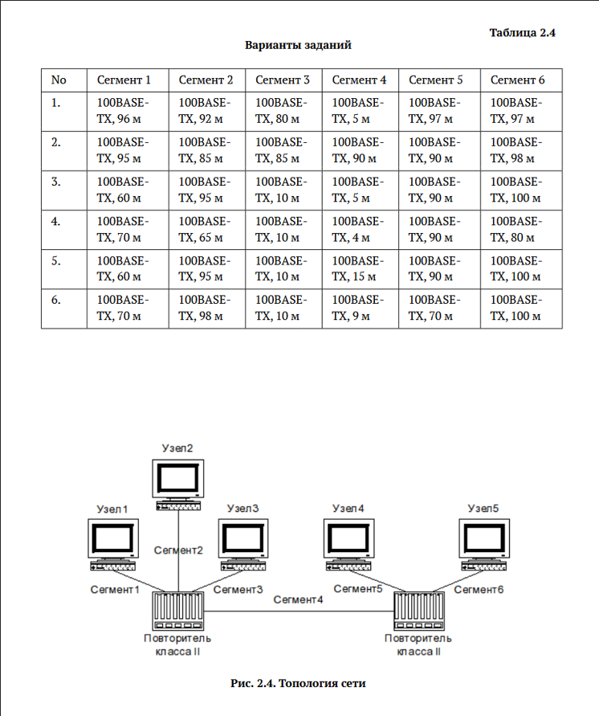
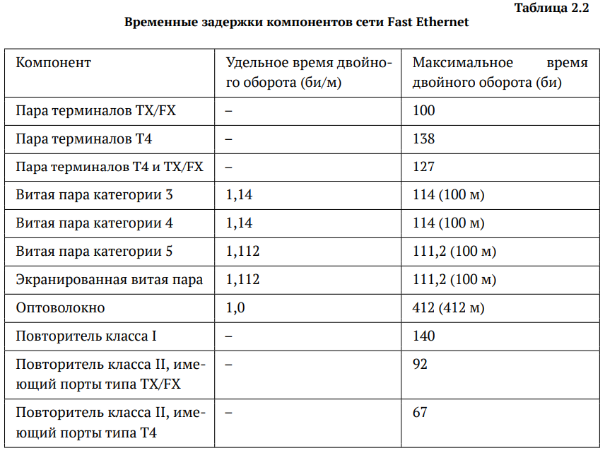
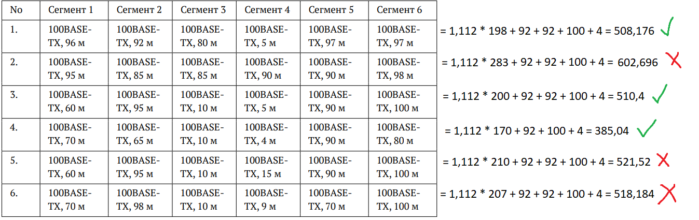

---
## Front matter
title: "Отчёт о лабораторной работе"
subtitle: "Лабораторная работа 2"
author: "Мошаров Денис Максимович"

## Generic otions
lang: ru-RU
toc-title: "Содержание"

## Bibliography
bibliography: bib/cite.bib
csl: pandoc/csl/gost-r-7-0-5-2008-numeric.csl

## Pdf output format
toc: true # Table of contents
toc-depth: 2
lof: true # List of figures
lot: true # List of tables
fontsize: 12pt
linestretch: 1.5
papersize: a4
documentclass: scrreprt
## I18n polyglossia
polyglossia-lang:
  name: russian
  options:
	- spelling=modern
	- babelshorthands=true
polyglossia-otherlangs:
  name: english
## I18n babel
babel-lang: russian
babel-otherlangs: english
## Fonts
mainfont: IBM Plex Serif
romanfont: IBM Plex Serif
sansfont: IBM Plex Sans
monofont: IBM Plex Mono
mathfont: STIX Two Math
mainfontoptions: Ligatures=Common,Ligatures=TeX,Scale=0.94
romanfontoptions: Ligatures=Common,Ligatures=TeX,Scale=0.94
sansfontoptions: Ligatures=Common,Ligatures=TeX,Scale=MatchLowercase,Scale=0.94
monofontoptions: Scale=MatchLowercase,Scale=0.94,FakeStretch=0.9
mathfontoptions:
## Biblatex
biblatex: true
biblio-style: "gost-numeric"
biblatexoptions:
  - parentracker=true
  - backend=biber
  - hyperref=auto
  - language=auto
  - autolang=other*
  - citestyle=gost-numeric
## Pandoc-crossref LaTeX customization
figureTitle: "Рис."
tableTitle: "Таблица"
listingTitle: "Листинг"
lofTitle: "Список иллюстраций"
lotTitle: "Список таблиц"
lolTitle: "Листинги"
## Misc options
indent: true
header-includes:
  - \usepackage{indentfirst}
  - \usepackage{float} # keep figures where there are in the text
  - \floatplacement{figure}{H} # keep figures where there are in the text
---

# Цель работы

изучение принципов технологий Ethernet и Fast Ethernet и практическое освоение методик оценки работоспособности сети, построенной на базе технологии Fast Ethernet.

# Задание

Оценить данную ниже сеть на работоспособность, согласно двум моделям

# Первая модель

Диаметр домена коллизий – максимальное расстояние среди всех расстояний между двумя узлами этого домена
Поскольку мы имеем дело с топологией, в которой 2 повторителя класса 2 и все узлы соединены между собой исключительно с помощью витой пары, согласно таблице ниже, допустимый диаметр должен быть не больше 205 метров. (рис. [-@fig:002]).

{#fig:002 width=100%}

Давайте составим таблицу, где будет 7 строк, первая из которых выражает номер сегмента, а остальные - варианты задания. Будет 8 столбцов, где первый столбец выражает номер варианта, а последний – диаметр. Остальные столбцы содержат информацию о длине сегмента. Сегменты, через которые будет проходить диаметр, будут выделены. (рис. [-@fig:003]).

{#fig:003 width=100%}

Как видим, диаметры 1, 3 и 4 вариантов сети меньше 205 метров, так что они являются работоспособными. Диаметры 2, 5 и 6 вариантов сети больше 205 метров, и не работоспособны

# Вторая модель

Согласно второй модели, мы должны рассчитать количество битовых интервалов для наихудшего в смысле распространения сигнала пути и сравнить это значение с числом 512, предварительно добавив к этому значению 4 битовых интервала. Давайте посмотрим на то, сколько битовых интервалов даёт каждое устройство с нашей топологии согласно ниже представленной таблице (рис. [-@fig:004]).

{#fig:004 width=100%}

Как видим, нам необходимо учитывать, через что мы проходим и с какой задержкой, выраженной во времени двойного оборота. Нужно найти участок между двумя узлами с самым большим временем двойного оборота. Очевидно, что самые худшие пути для всех вариантов были вычислены при подсчёте работоспособности для первой модели, однако, вероятно, это будет не гарантированно только для 4 варианта, поскольку в нём самый длинный путь был не через 2 повторителя, а второй повторитель даёт весомое время двойного оборота. Начинаем считать. 

## Первый вариант

Самый худший путь имеет следующее количество временных интервалов:   
100 (узел) + 96 * 1,112 (первый сегмент) + 92 (повторитель класса 2) + 5 * 1,112 (четвёртый сегмент) + 92 (повторитель класса 2) + 97 * 1,112 (пятый сегмент) = 504,176  
Прибавляем 4 => 508,176  

## Второй вариант

Самый худший путь имеет следующее количество временных интервалов:   
100 (узел) + 95 * 1,112 (первый сегмент) + 92 (повторитель класса 2) + 90 * 1,112 (четвёртый сегмент) + 92 (повторитель класса 2) + 98 * 1,112 (шестой сегмент) = 598,584  
Прибавляем 4 => 602,584  

## Третий вариант

Самый худший путь имеет следующее количество временных интервалов:   
100 (узел) + 95 * 1,112 (второй сегмент) + 92 (повторитель класса 2) + 5 * 1,112 (четвёртый сегмент) + 92 (повторитель класса 2) + 100 * 1,112 (шестой сегмент) = 506,4  
Прибавляем 4 => 510,4  

## Четвёртый вариант

Самый худший путь имеет следующее количество временных интервалов (Заметим, что путь отличается от того, что был в первой модели, так как он всего на 6 метров короче, но зато идёт через второй повторитель, который даёт гораздо больше задержки, чем 6 метров кабеля витой пары):   
100 (узел) + 70 * 1,112 (первый сегмент) + 92 (повторитель класса 2) + 4 * 1,112 (четвёртый сегмент) + 92 (повторитель класса 2) + 90 * 1,112 (пятый сегмент) = 466,368  
Прибавляем 4 => 470,368  

## Пятый вариант

Самый худший путь имеет следующее количество временных интервалов:   
100 (узел) + 95 * 1,112 (второй сегмент) + 92 (повторитель класса 2) + 15 * 1,112 (четвёртый сегмент) + 92 (повторитель класса 2) + 100 * 1,112 (шестой сегмент) = 517,52  
Прибавляем 4 => 521,52  

## Шестой вариант

Самый худший путь имеет следующее количество временных интервалов:   
100 (узел) + 98 * 1,112 (второй сегмент) + 92 (повторитель класса 2) + 9 * 1,112 (четвёртый сегмент) + 92 (повторитель класса 2) + 100 * 1,112 (шестой сегмент) = 514,184  
Прибавляем 4 => 518,184  

## Результаты по второй модели

Получаем, что варианты 1, 3 и 4 являются работоспособными, так как время двойного оборота по наихудшему пути + 4 меньше 512 двойных оборотов. Варианты 2, 5 и 6 - неработоспособны

{#fig:005 width=100%}

# Выводы

в результате выполнения работы были получены навыки анализа работоспособности ethernet сетей и их принцип работы
