---
## Front matter
title: "Отчёт о лабораторной работе"
subtitle: "Лабораторная работа 3"
author: "Мошаров Денис Максимович"

## Generic otions
lang: ru-RU
toc-title: "Содержание"

## Bibliography
bibliography: bib/cite.bib
csl: pandoc/csl/gost-r-7-0-5-2008-numeric.csl

## Pdf output format
toc: true # Table of contents
toc-depth: 2
lof: true # List of figures
lot: true # List of tables
fontsize: 12pt
linestretch: 1.5
papersize: a4
documentclass: scrreprt
## I18n polyglossia
polyglossia-lang:
  name: russian
  options:
	- spelling=modern
	- babelshorthands=true
polyglossia-otherlangs:
  name: english
## I18n babel
babel-lang: russian
babel-otherlangs: english
## Fonts
mainfont: IBM Plex Serif
romanfont: IBM Plex Serif
sansfont: IBM Plex Sans
monofont: IBM Plex Mono
mathfont: STIX Two Math
mainfontoptions: Ligatures=Common,Ligatures=TeX,Scale=0.94
romanfontoptions: Ligatures=Common,Ligatures=TeX,Scale=0.94
sansfontoptions: Ligatures=Common,Ligatures=TeX,Scale=MatchLowercase,Scale=0.94
monofontoptions: Scale=MatchLowercase,Scale=0.94,FakeStretch=0.9
mathfontoptions:
## Biblatex
biblatex: true
biblio-style: "gost-numeric"
biblatexoptions:
  - parentracker=true
  - backend=biber
  - hyperref=auto
  - language=auto
  - autolang=other*
  - citestyle=gost-numeric
## Pandoc-crossref LaTeX customization
figureTitle: "Рис."
tableTitle: "Таблица"
listingTitle: "Листинг"
lofTitle: "Список иллюстраций"
lotTitle: "Список таблиц"
lolTitle: "Листинги"
## Misc options
indent: true
header-includes:
  - \usepackage{indentfirst}
  - \usepackage{float} # keep figures where there are in the text
  - \floatplacement{figure}{H} # keep figures where there are in the text
---

# Цель работы

Изучение посредством Wireshark кадров Ethernet, анализ PDU протоколов транспортного и прикладного уровней стека TCP/IP.

# Выполнение

Пропишем команду ipconfig. В качестве вывода мы получим различные соединения, в том числе наше активное (последнее). Из получаемой информации видим ipv6 адрес, ipv4 адрес, маску подсети и основной шлюз (рис. [-@fig:001]).

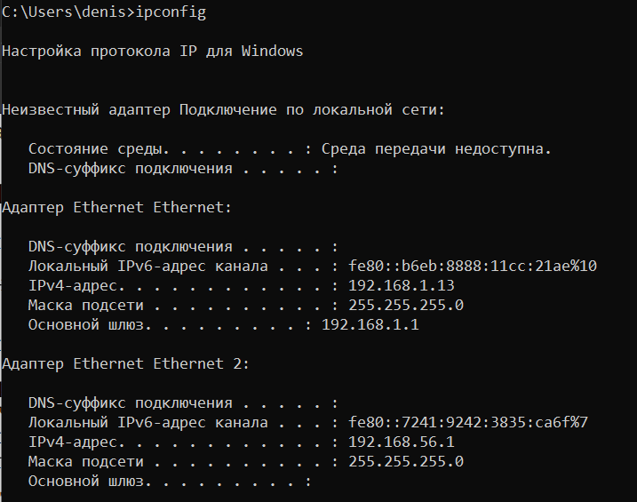{#fig:001 width=70%}

Указав к ipconfig ключ /all, мы получим более подробную информацию, в том числе физический адрес (mac). В нашем случае mac адрес имеет вид. Первые 3 байта - это идентификатор производителя, а остальные 3 - интерфейса. В первом байте зашита информация о том, что адрес индивидуальный, и что является глобально администр, поскольку последние 2 бита в двоичной системе, если переводить из hex, равны нулям (рис. [-@fig:002]).

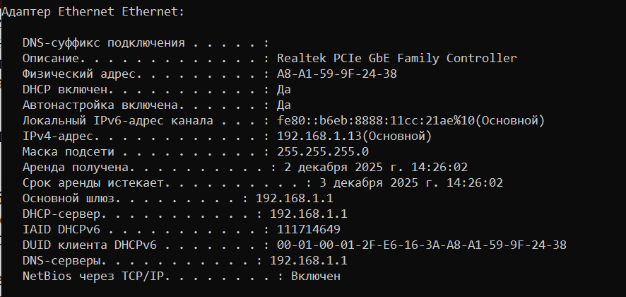{#fig:002 width=70%}

Откроем wireshark и выберем сетевое подключение, которое активно. В нашем случае, это беспроводная сеть (рис. [-@fig:003]).

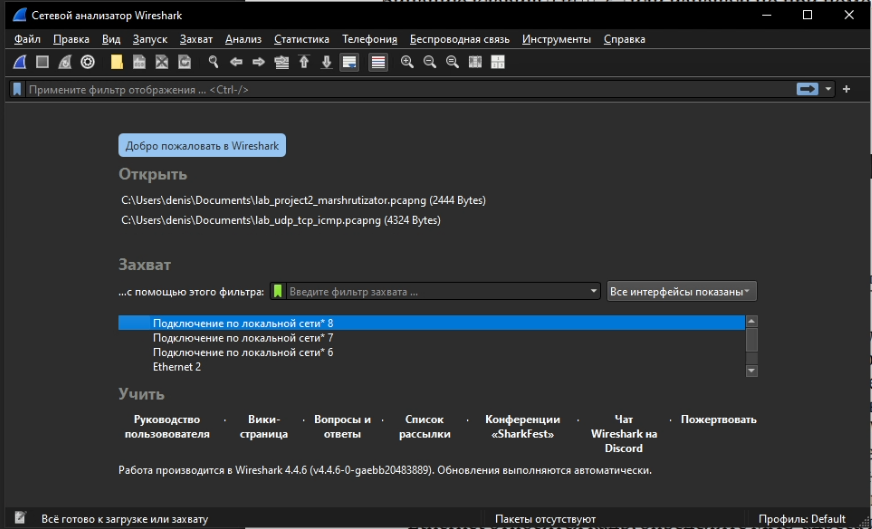{#fig:003 width=70%}

Так выглядит интерфейс (рис. [-@fig:004]).

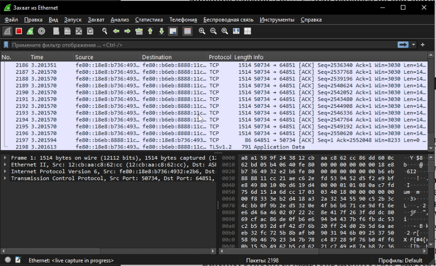{#fig:004 width=70%}

Попробуем пинг к шлюзу, адрес которого мы получили в самом начале (рис. [-@fig:005]).

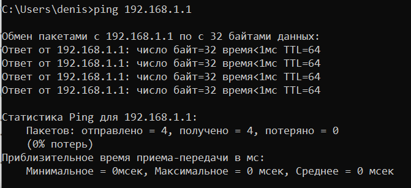{#fig:005 width=70%}

Переходим обратно в wireshark и посмотрим на icmp пакеты. Поскольку было передано 4 пакета, то мы видим 8 записей (на каждый пакет получение и отправка) (рис. [-@fig:006]).

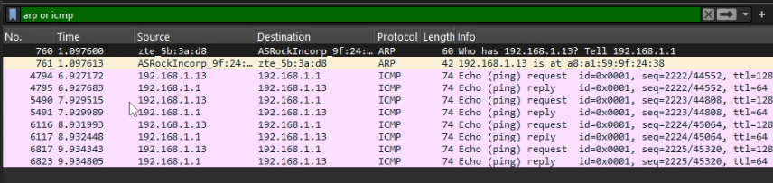{#fig:006 width=70%}

Изучим самый первый, исходящий пакет. Как видим, длина фрейма составляет 74 байта, используется тип ethernet 2 и мы так же можем видеть физические адреса отправителя (то есть наш) и получателя (то есть шлюза). Оба адреса являются индивидуальными и глобально администрируемыми (рис. [-@fig:007]).

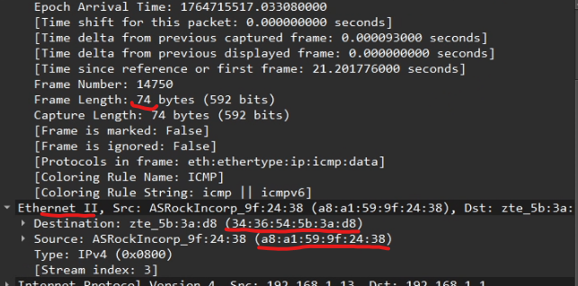{#fig:007 width=70%}

Теперь посмотрим на ответный фрейм. Он, по сути, практически не отличается от исходящего, только адреса отправителя и получателя поменяны местами (рис. [-@fig:008]).

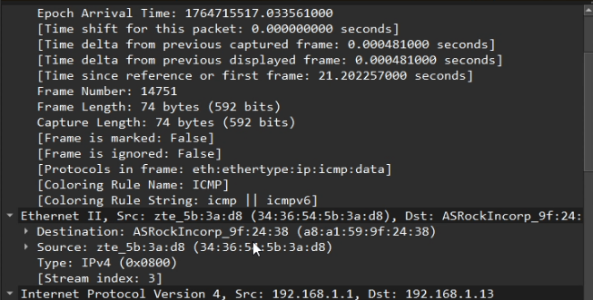{#fig:008 width=70%}

Посмотрим теперь на arp пакеты. В них не много информации. Они отвечают за получение физического адреса. Так, мы видим, что первый arp пакет пытается получить адрес нашего устройства (рис. [-@fig:009]).

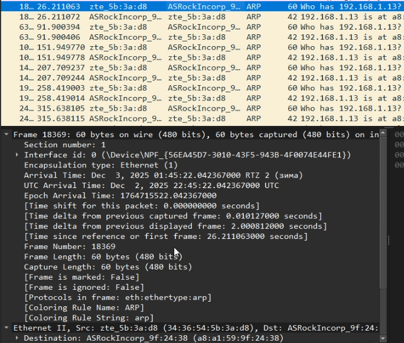{#fig:009 width=70%}

Второй arp пакет является обратным, то есть мы получаем адрес шлюза. В обоих случаях в заголовке ethernet 2 хранится физический адрес обоих устройств, но в первом случае тип является vlan, а во втором - arp (рис. [-@fig:010]).

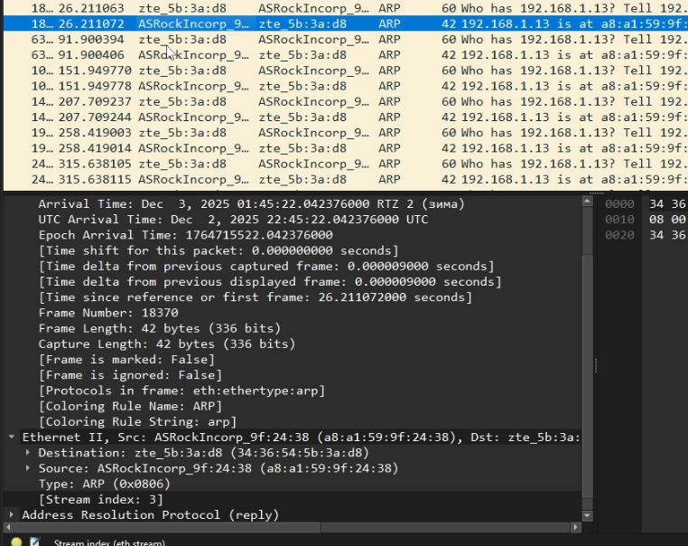{#fig:010 width=70%}

Теперь пингуем яндекс.ру (рис. [-@fig:011]).

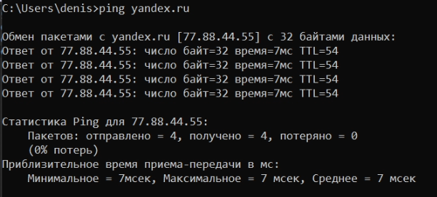{#fig:011 width=70%}

Посмотрм на arp пакеты. Как видим, их 2. Как и в прошлый раз, клиент и шлюз пытаются обменяться физическими адресами (рис. [-@fig:012]).

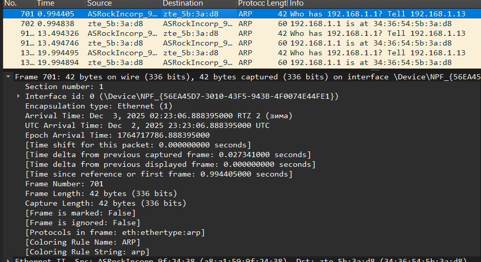{#fig:012 width=70%}

Второй arp пакет отличается, как обычно, только направлением (рис. [-@fig:013]).

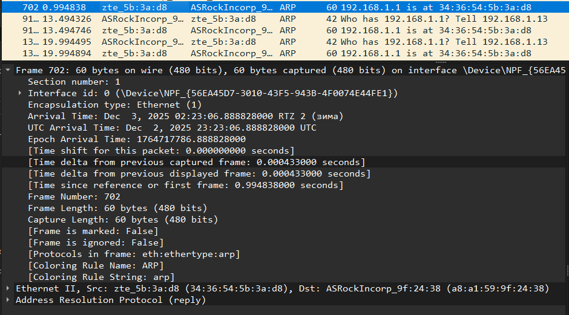{#fig:013 width=70%}

Теперь посмотрим на icmp пакеты. их как обычно 8. Как видим, тут уже есть небольшая разница. Теперь мы обращаемся не к шлюзу, а прямо к серверу яндекса. Мы можем видеть, что ip другой. Однако, в рамках ethernet 2 мы всё ещё общаемся со шлюзом (рис. [-@fig:014]).

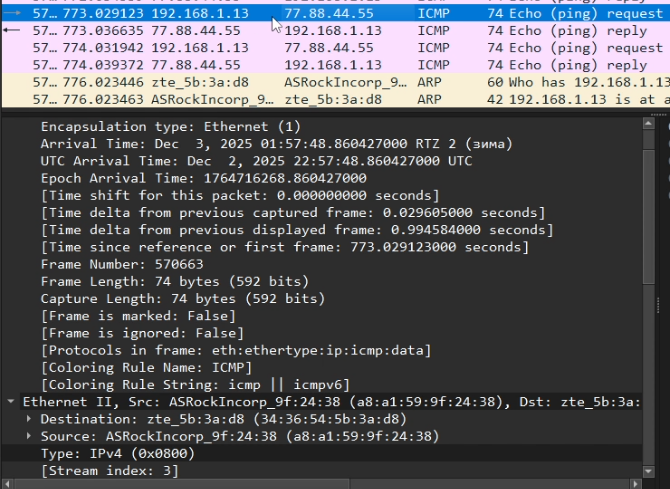{#fig:014 width=70%}

Входящий пакет icmp, то есть, ответный, не будет сильно отличаться от входящего, только направлением (рис. [-@fig:015]).

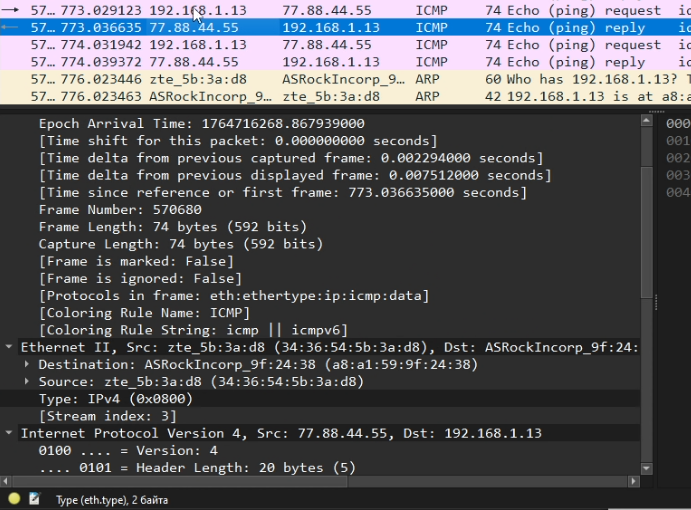{#fig:015 width=70%}

Посетим сайт по протоколу http (рис. [-@fig:016]).

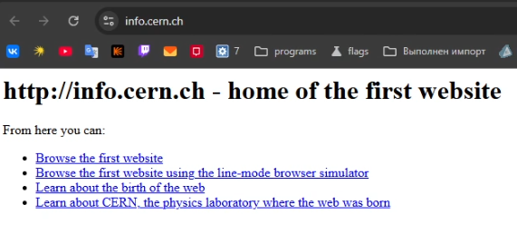{#fig:016 width=70%}

Посмотрим на http пакеты. Как видим, они есть и входящие, и исходящие. Работает http поверх tcp. Мы видим, что информация в разделе о tcp говорит о входящем и исходящем портах, о длине сегмента, флагах и чексумме (рис. [-@fig:017]).

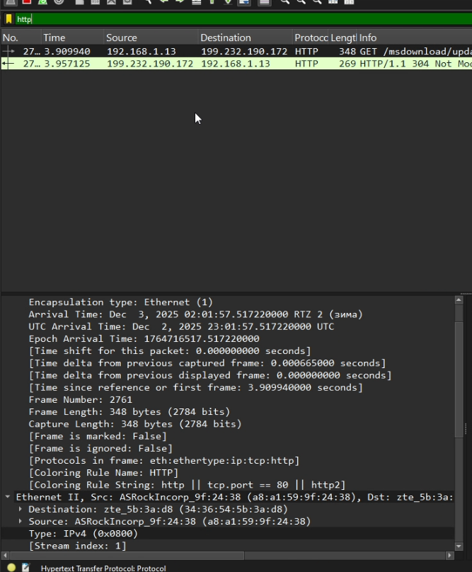{#fig:017 width=70%}

Входящий пакет же будет отличаться тем, что длина сегмента и checksumm будут другие, а порты поменяются местами (рис. [-@fig:018]).

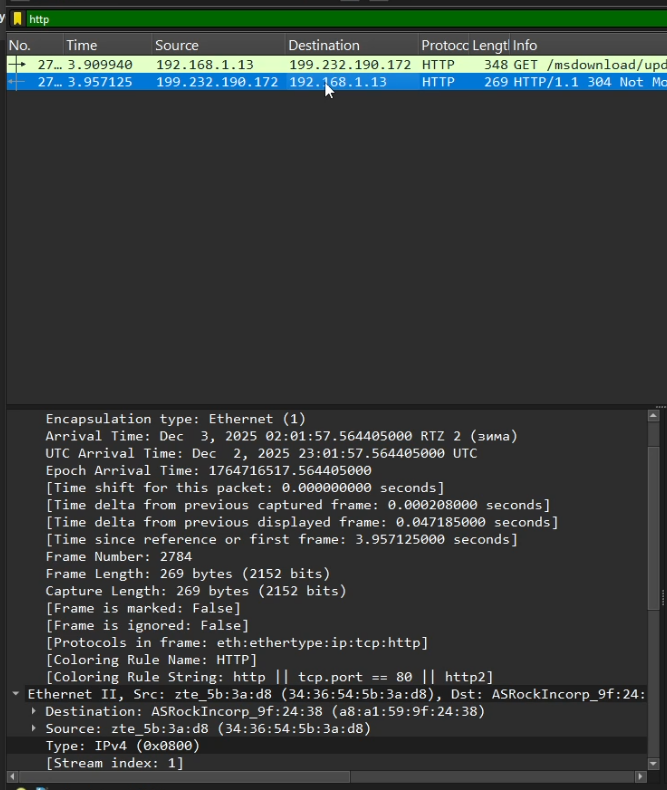{#fig:018 width=70%}

Теперь рассмотрим dns пакеты. Они уже работают по udp. Сам раздел по udp даёт не так много информации, как tcp, однако информация о портах, длине и чексумме присутствует (рис. [-@fig:019]).

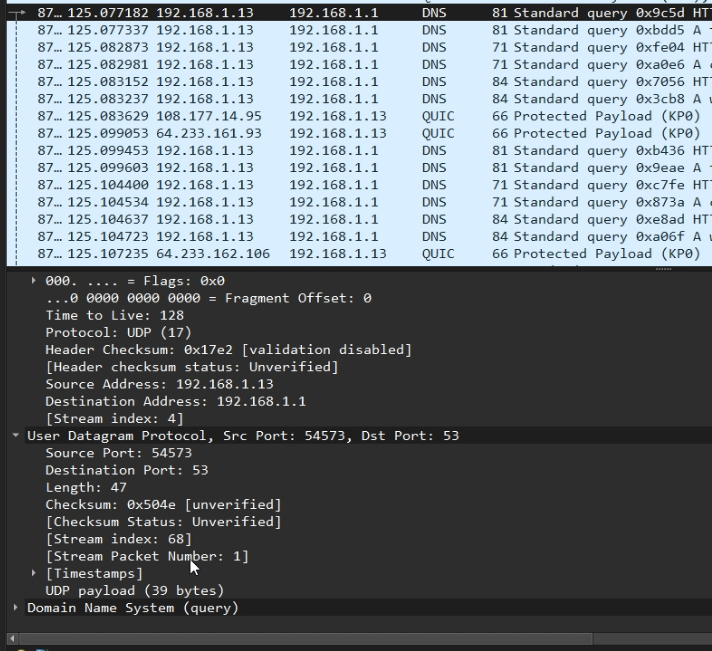{#fig:019 width=70%}

Входящий пакет с точки зрения udp будет отличаться поменянными местами портами, чексуммой и длиной (рис. [-@fig:020]).

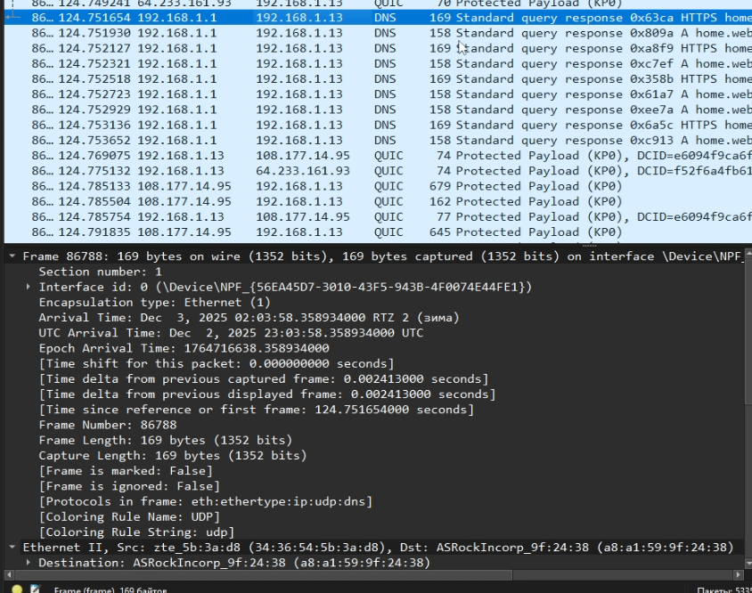{#fig:020 width=70%}

Теперь рассмотрим quic. Он работает поверх udp, и в рамках уровня udp содержит примерно ту же информацию, что и dns (рис. [-@fig:021]).

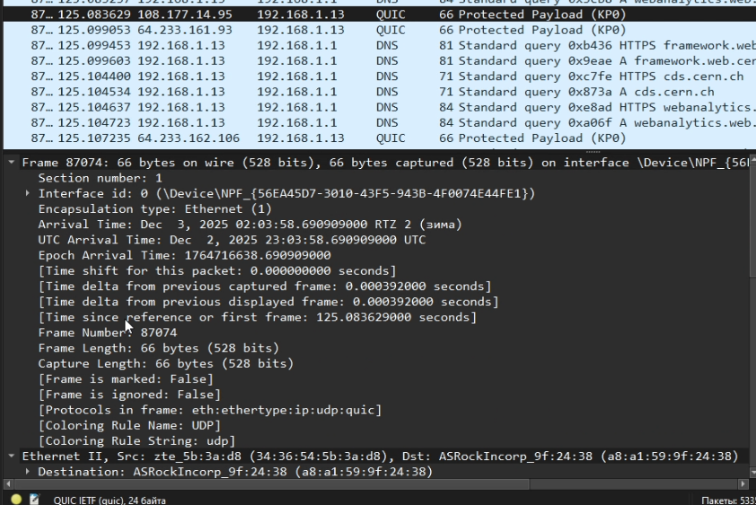{#fig:021 width=70%}

И различия между входящим и исходящим пакетом ровно такие же (рис. [-@fig:022]).

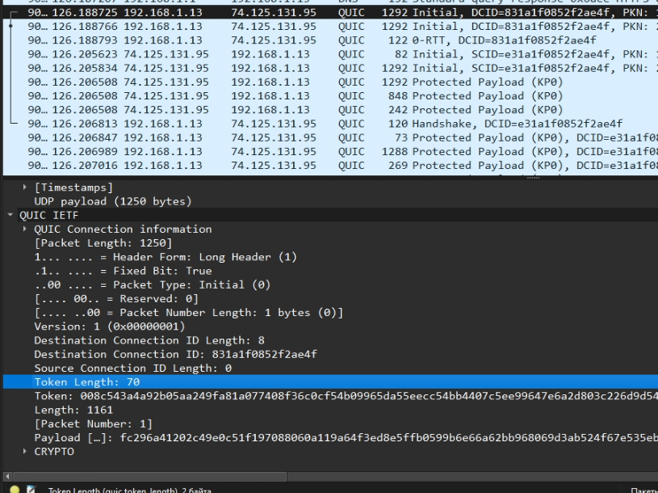{#fig:022 width=70%}

Теперь рассмотрим процесс хендшейка. Для этого перезагрузим http страницу и посмотрим, что происходит перед тем, как происходит http запрос get. Для начала, клиент отправляет серверу syn запрос, что мы можем видеть во флагах tcp (рис. [-@fig:023]).

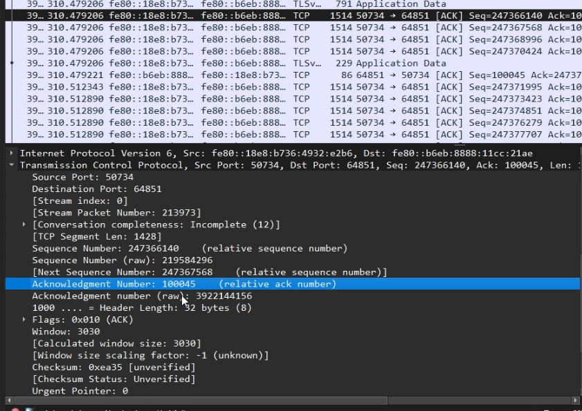{#fig:023 width=70%}

Сервер, дает руку, давая ответ в виде syn и ack, в котором говорит, что теперь знает о клиенте (рис. [-@fig:024]).

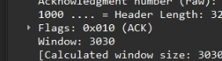{#fig:024 width=70%}

Клиенту остаётся взять руку, сказав, что тоже теперь о нём знает, при этом флаг syn больше не стоит, поскольку оба они теперь знают о друг друге, и запрос на синхронизацию больше не нужен (рис. [-@fig:025]).

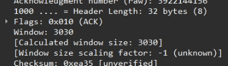{#fig:025 width=70%}

Теперь посмотрим на график потока. Здесь можно явно увидеть процесс хендшейка прямо перед get запросом (рис. [-@fig:026]).

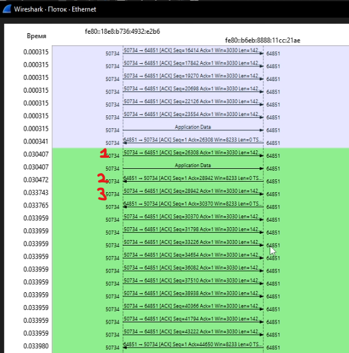{#fig:026 width=70%}

# Выводы

В результате выполнения работы были получены навыки анализа пакетов в wireshark