---
## Front matter
title: "Отчёт о лабораторной работе"
subtitle: "Лабораторная работа 4"
author: "Мошаров Денис Максимович"

## Generic otions
lang: ru-RU
toc-title: "Содержание"

## Bibliography
bibliography: bib/cite.bib
csl: pandoc/csl/gost-r-7-0-5-2008-numeric.csl

## Pdf output format
toc: true # Table of contents
toc-depth: 2
lof: true # List of figures
lot: true # List of tables
fontsize: 12pt
linestretch: 1.5
papersize: a4
documentclass: scrreprt
## I18n polyglossia
polyglossia-lang:
  name: russian
  options:
	- spelling=modern
	- babelshorthands=true
polyglossia-otherlangs:
  name: english
## I18n babel
babel-lang: russian
babel-otherlangs: english
## Fonts
mainfont: IBM Plex Serif
romanfont: IBM Plex Serif
sansfont: IBM Plex Sans
monofont: IBM Plex Mono
mathfont: STIX Two Math
mainfontoptions: Ligatures=Common,Ligatures=TeX,Scale=0.94
romanfontoptions: Ligatures=Common,Ligatures=TeX,Scale=0.94
sansfontoptions: Ligatures=Common,Ligatures=TeX,Scale=MatchLowercase,Scale=0.94
monofontoptions: Scale=MatchLowercase,Scale=0.94,FakeStretch=0.9
mathfontoptions:
## Biblatex
biblatex: true
biblio-style: "gost-numeric"
biblatexoptions:
  - parentracker=true
  - backend=biber
  - hyperref=auto
  - language=auto
  - autolang=other*
  - citestyle=gost-numeric
## Pandoc-crossref LaTeX customization
figureTitle: "Рис."
tableTitle: "Таблица"
listingTitle: "Листинг"
lofTitle: "Список иллюстраций"
lotTitle: "Список таблиц"
lolTitle: "Листинги"
## Misc options
indent: true
header-includes:
  - \usepackage{indentfirst}
  - \usepackage{float} # keep figures where there are in the text
  - \floatplacement{figure}{H} # keep figures where there are in the text
---

# Цель работы

Установка и настройка GNS3 и сопутствующего программного обеспечения

# Выполнение

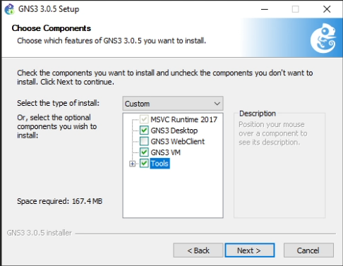{#fig:002 width=70%}

Нас попросят выбрать тип ВМ, мы выбираем VirtualBox (рис. [-@fig:003]).

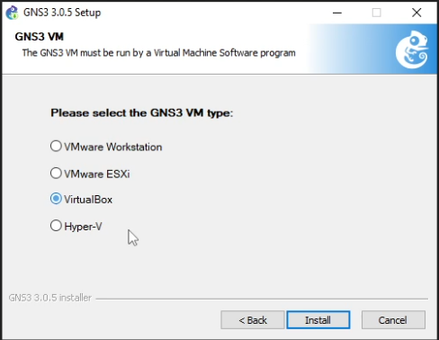{#fig:003 width=70%}

Во время установки нам высветится окно, в котором будет указано, куда скачался файл с образом вируальной машины под VirtualBox (рис. [-@fig:004]).

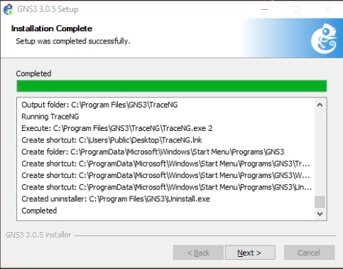{#fig:004 width=70%}

Соглашаемся с лицензией во время установки (рис. [-@fig:005]).

{#fig:005 width=70%}

После этого установщик скажет, что установка прошла успено. Далее, нам необходимо войти в VirtualBox, и импортировать образ виртуальной машины, который был скачан и путь к архиву с которым высвечивался во время установки. Этот файл нужно распаковать и после этого указать путь к этому файлу (рис. [-@fig:006]).

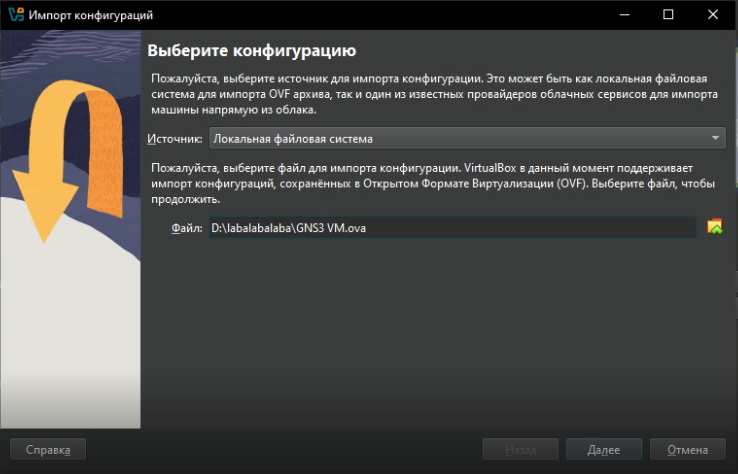{#fig:006 width=70%}

Укажем, что политика MAC адреса это генерация новых адресов для всех сетевых адаптеров (рис. [-@fig:007]).

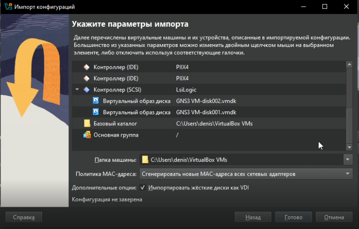{#fig:007 width=70%}

Убедимся, что она включена. Так же убедимся в том, что мы выделили достаточно ядер (больше 2), и больше 2гб оперативной памяти (рис. [-@fig:009]).

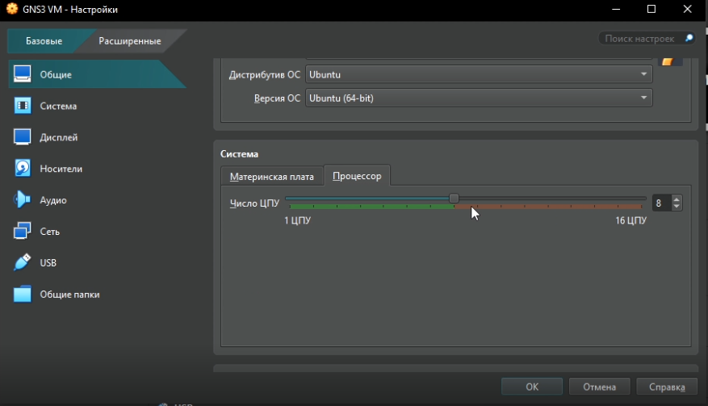{#fig:009 width=70%}

Посмотрим на адаптеры. Первый должен быть виртуальным адаптером хоста (рис. [-@fig:010]).

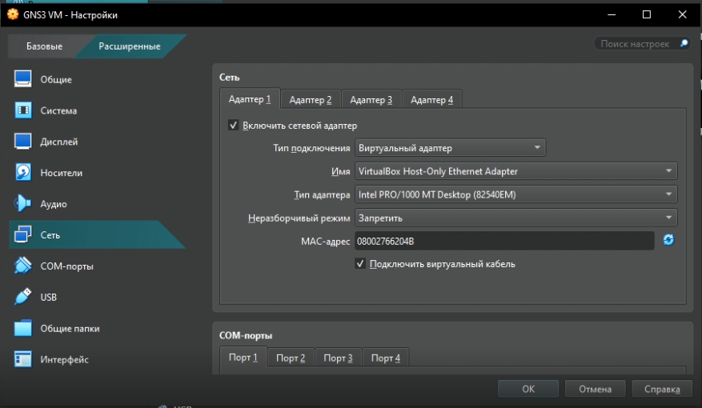{#fig:010 width=70%}

После включения виртуальной машины будет выведено следующее окно. Данные отсюда понадобятся позже для подключения клиента (рис. [-@fig:012]).

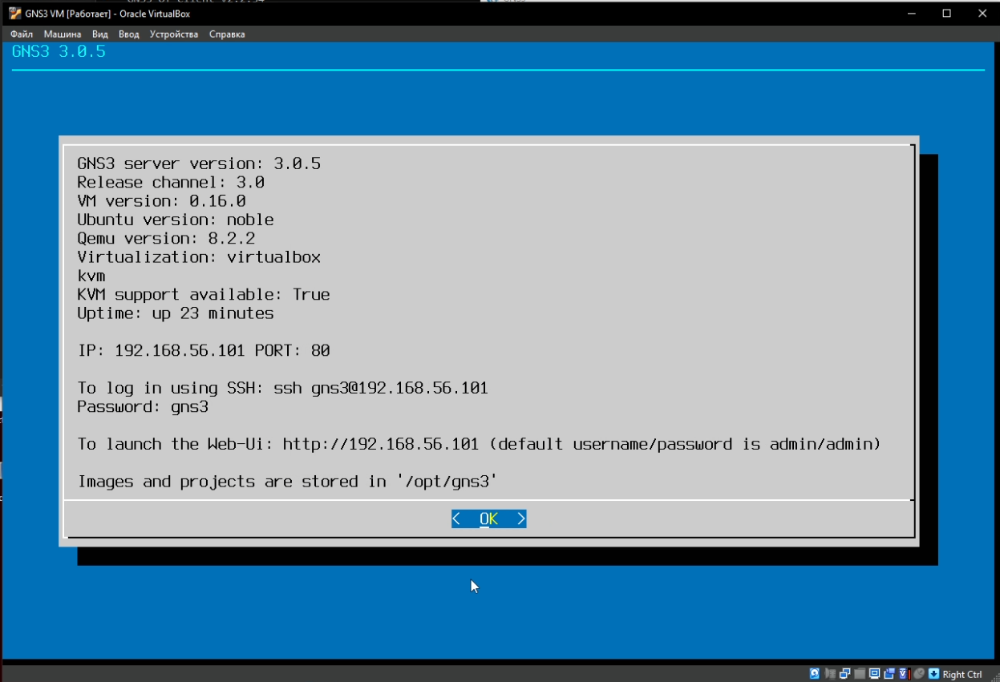{#fig:012 width=70%}

Теперь запустим сам клиент GNS3 All in One. Он предложит подключить контроллер. Мы можем подключить только удалённый контроллер. Не смотря на то, что в лабораторной работе требуется подключение к локальному устройству, в новых версиях этой программы такой опции нет, однако ключевой разницы между этими вариантами в рамках подготовки стенда не наблюдается (рис. [-@fig:013]).

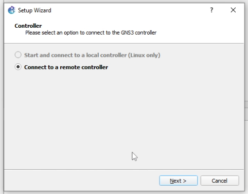{#fig:013 width=70%}

На следующем этапе мы указываем данные для подключения. Эти данные мы могли видеть призапуске виртуальной машины (рис. [-@fig:014]).

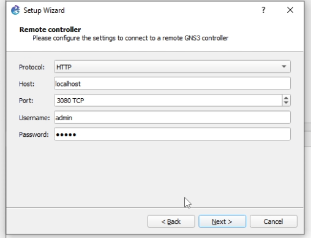{#fig:014 width=70%}

Подключение оказывается успешным, и мы можем видеть окно с итоговой информацией (рис. [-@fig:015]).

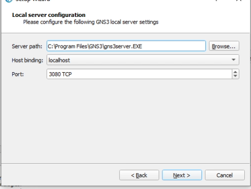{#fig:015 width=70%}

Выйдем из клиента (рис. [-@fig:016]).

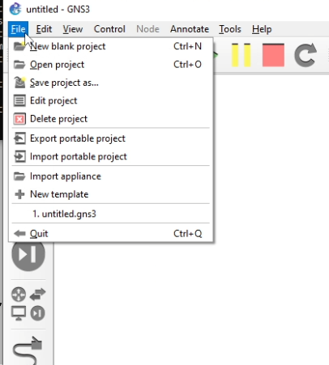{#fig:016 width=70%}

Снова запустим клиент и в меню роутеров нажмём на кнопку добавления темплейта. Тут выбираем первый вариант (установка с сервера) (рис. [-@fig:017]).

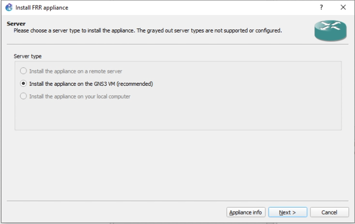{#fig:017 width=70%}

Далее, необходимо выбрать какой именно роутер и система нам нужны. Выбираем из списка FRR (рис. [-@fig:018]).

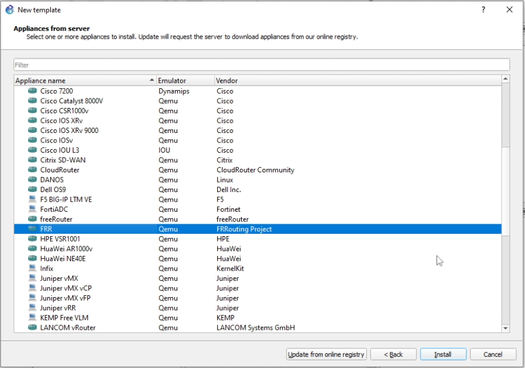{#fig:018 width=70%}

После этого будет меню выбора версий. Тут мы выбираем самую новую, и нажимаем Download, после чего с сайта скачиваем образ (рис. [-@fig:020]).

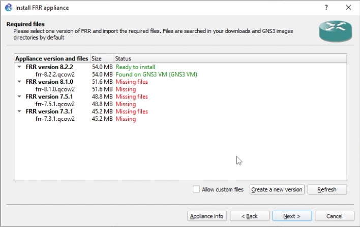{#fig:020 width=70%}

Нажав на кнопку Import, мы выбираем скаченный файл образа (рис. [-@fig:021]).

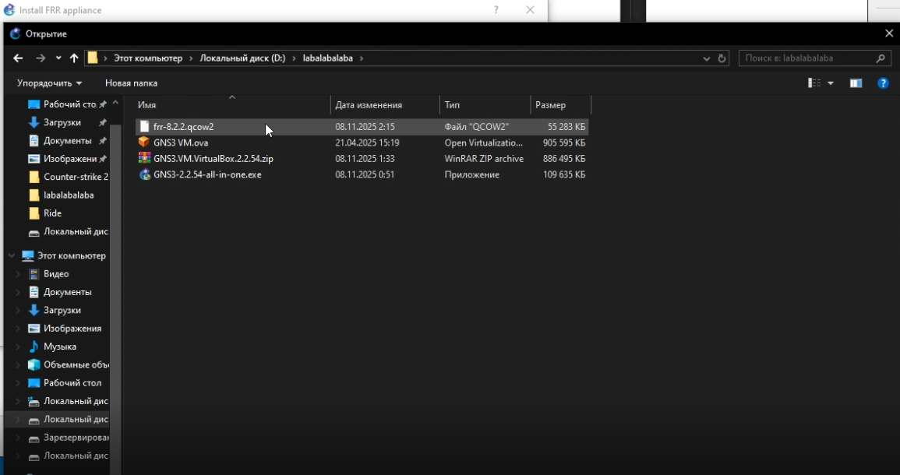{#fig:021 width=70%}

После того, как образ импортирован, мы можем нажимать далее (рис. [-@fig:022]).

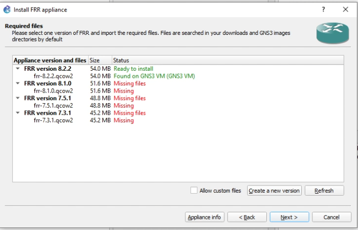{#fig:022 width=70%}

Соглашаемся с установкой (рис. [-@fig:023]).

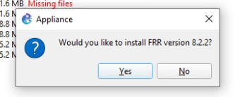{#fig:023 width=70%}

Нам далее высветится окно с успешной установкой (рис. [-@fig:024]).

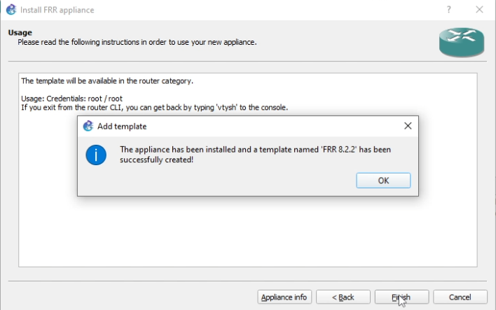{#fig:024 width=70%}

Теперь в списке роутеров появится новый теплейт. Сконфигурируем его (рис. [-@fig:025]).

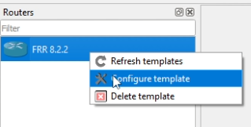{#fig:025 width=70%}

Укажем send the shutdown signal при on close (рис. [-@fig:026]).

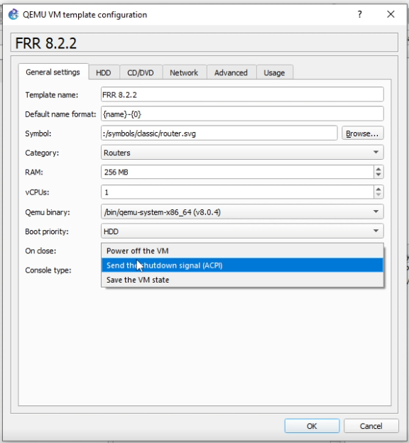{#fig:026 width=70%}

В дисках включим опцию Automatically create a config disk on hdd (рис. [-@fig:027]).

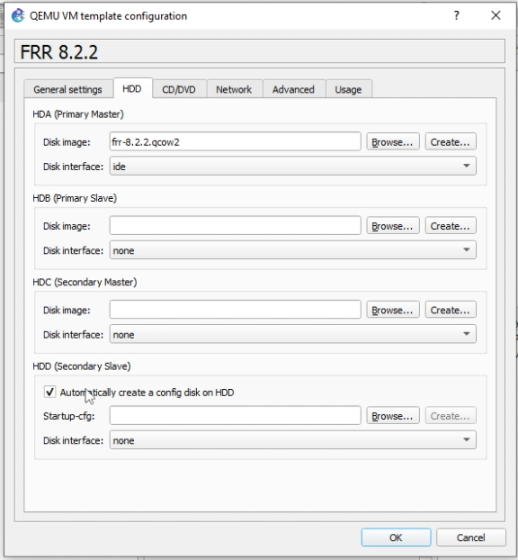{#fig:027 width=70%}

Далее нужно импортировать VyOS. Поскольку он требует лицензию, его можно скачать с гитхаба, где лежит заготовленный для курса образ. Мы скачиваем 2 файла - qcow2 и gns3a (рис. [-@fig:028]).

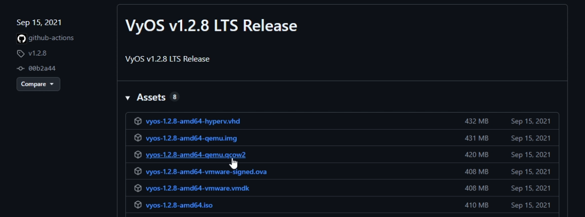{#fig:028 width=70%}

Далее при создании нового темплейта мы выбираем не скачивание, а импорт (рис. [-@fig:029]).

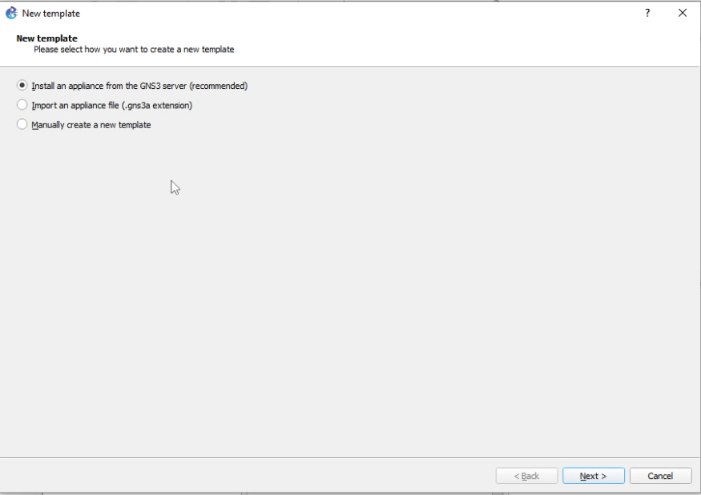{#fig:029 width=70%}

Импортируем файл gns3a (рис. [-@fig:030]).

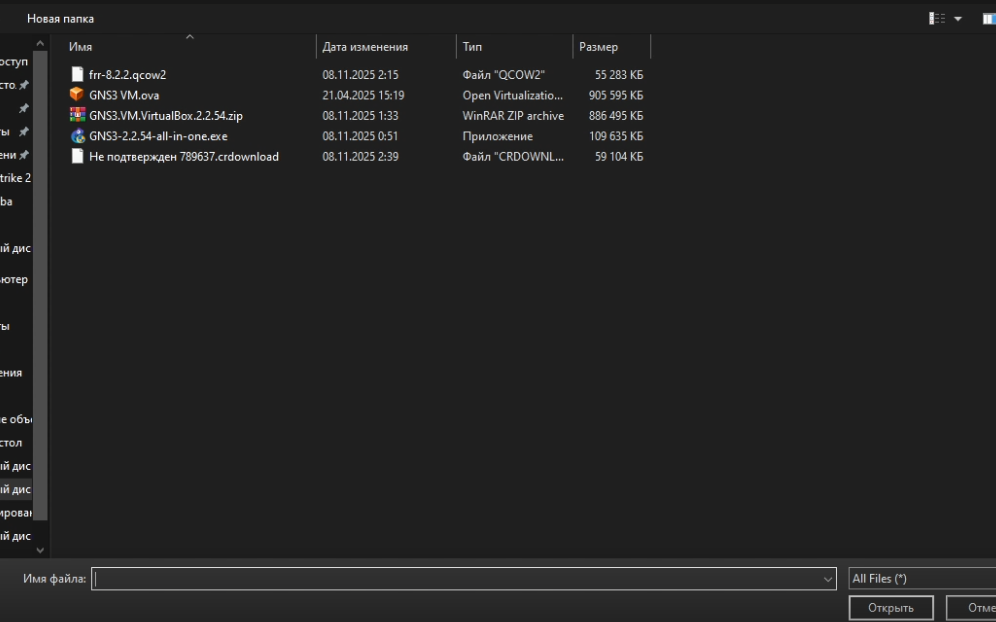{#fig:030 width=70%}

Теперь так же, как для прошлого роутера, выбираем ACPI для On close (рис. [-@fig:034]).

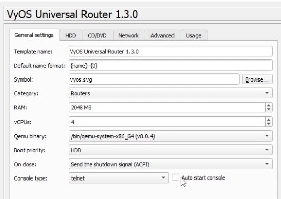{#fig:034 width=70%}

И выбираем опцию Automatically create a config disk on hdd (рис. [-@fig:035]).

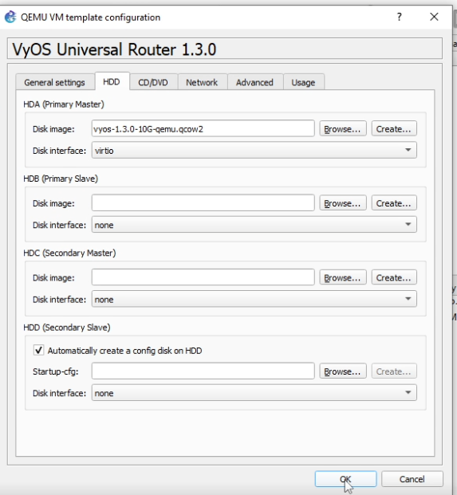{#fig:035 width=70%}

# Выводы

В результате выполнения лабораторной работы был настроен стенд GNS3 и импортированы роутеры. Был получен навык настройки стенда