---
## Front matter
title: "Отчёт о лабораторной работе"
subtitle: "Лабораторная работа 6"
author: "Мошаров Денис Максимович"

## Generic otions
lang: ru-RU
toc-title: "Содержание"

## Bibliography
bibliography: bib/cite.bib
csl: pandoc/csl/gost-r-7-0-5-2008-numeric.csl

## Pdf output format
toc: true # Table of contents
toc-depth: 2
lof: true # List of figures
lot: true # List of tables
fontsize: 12pt
linestretch: 1.5
papersize: a4
documentclass: scrreprt
## I18n polyglossia
polyglossia-lang:
  name: russian
  options:
	- spelling=modern
	- babelshorthands=true
polyglossia-otherlangs:
  name: english
## I18n babel
babel-lang: russian
babel-otherlangs: english
## Fonts
mainfont: IBM Plex Serif
romanfont: IBM Plex Serif
sansfont: IBM Plex Sans
monofont: IBM Plex Mono
mathfont: STIX Two Math
mainfontoptions: Ligatures=Common,Ligatures=TeX,Scale=0.94
romanfontoptions: Ligatures=Common,Ligatures=TeX,Scale=0.94
sansfontoptions: Ligatures=Common,Ligatures=TeX,Scale=MatchLowercase,Scale=0.94
monofontoptions: Scale=MatchLowercase,Scale=0.94,FakeStretch=0.9
mathfontoptions:
## Biblatex
biblatex: true
biblio-style: "gost-numeric"
biblatexoptions:
  - parentracker=true
  - backend=biber
  - hyperref=auto
  - language=auto
  - autolang=other*
  - citestyle=gost-numeric
## Pandoc-crossref LaTeX customization
figureTitle: "Рис."
tableTitle: "Таблица"
listingTitle: "Листинг"
lofTitle: "Список иллюстраций"
lotTitle: "Список таблиц"
lolTitle: "Листинги"
## Misc options
indent: true
header-includes:
  - \usepackage{indentfirst}
  - \usepackage{float} # keep figures where there are in the text
  - \floatplacement{figure}{H} # keep figures where there are in the text
---

# Цель работы

Изучение принципов распределения и настройки адресного пространства на устройствах сети

# Выполнение теоретической части. IPv4

1. Задана IPv4-сеть 172.16.20.0/24. Для заданной сети определите префикс, маску, broadcast-адрес, число возможных подсетей, диапазон адресов узлов. Разбейте сеть на 3 подсети с максимально возможным числом адресов узлов 126, 62, 62 соответственно.   
Длина префикса – 24 (число после слэша), полный адрес сети – 172.16.20.0/24   
Маска – 255.255.255.0 (в двоичном виде - 11111111.11111111.11111111.00000000, кол-во единиц равно длине префикса)   
Broadcast-адрес – 172.16.20.255 (не трогаем биты, входящие в маску (то есть первые 24), а остальные ставим в положение 1 (то есть оставшиеся 8, обозначающие 1 байт). Последний байт будет 11111111, то есть 255, первые 3 байта не меняются)   
Число возможных подсетей – Если иметь ввиду максимальное число подсетей, на которое можно разбить сеть, то это 2^6 = 64 (то есть мы можем взять из битов адреса узла (8 бит), ещё 6 под маски, оставив 2 бита как минимум, из которого можно составить адреса узлов, дав так же место под broadcast и неопределённый адрес)   
Диапазон адресов узлов – 172.16.20.1-172.16.20.254   

Разбивка по подсетям:   
1. Поскольку для первой подсети мы можем иметь максимум 126 адресов узлов, мы должны сделать такую подсеть, которая вмещает в себя ровно 128 адресов (+2 узла на broadcast и неопределённый адрес). Таким образом, нам нужно, чтобы под часть адреса, отвечающую за узлы, было выделено 7 битов (2^7=128). Тогда, маска подсети это 32-7=25. 25ый бит сети будет равен 0. Итого имеем сеть 172.16.20.0/25, с диапазоном для адресов узлов равным 172.16.20.1-172.16.20.126   
2. Для второй подсети мы можем иметь максимум 62 адресов узлов, мы должны сделать такую подсеть, которая вмещает в себя ровно 64 адреса. Таким образом, нам нужно, чтобы под часть адреса, отвечающую за узлы, было выделено 6 битов. Маска будет равна 26. 25ый бит сети будет равен 1, а 26ой – 0. Итого, получаем сеть 172.16.20.128/26 c с диапазоном 172.16.20.129-172.16.20.190   
3. Для третей подсети мы можем иметь максимум 62 адресов узлов, мы должны сделать такую подсеть, которая вмещает в себя ровно 64 адреса. Таким образом, нам нужно, чтобы под часть адреса, отвечающую за узлы, было выделено 6 битов. Маска будет равна 26. 25ый бит сети будет равен 1, а 26ой – уже 1, в отличие от второй подсети. Итого, получаем сеть 172.16.20.192/26 c с диапазоном 172.16.20.193-172.16.20.191   

2. Задана сеть 10.10.1.64/26. Для заданной сети определите префикс, маску, broadcast-адрес, число возможных подсетей, диапазон адресов узлов. Выделите в этой сети подсеть на 30 узлов. Запишите характеристики для выделенной подсети.   

Длина префикса – 26 (число после слэша), полный адрес сети – 10.10.1.64/26   
Маска – 255.255.255.192 (в двоичном виде - 11111111.11111111.11111111.11000000, кол-во единиц равно длине префикса)   
Broadcast-адрес – 10.10.1.127 (не трогаем биты, входящие в маску (то есть первые 26), а остальные ставим в положение 1 (то есть оставшиеся 6). Последний байт будет 01111111, то есть 127, первые 3 байта не меняются)   
Число возможных подсетей – Если иметь ввиду максимальное число подсетей, на которое можно разбить сеть, то это 2¬^4 = 16 (то есть мы можем взять из битов адреса узла (6 бит), ещё 4 под маски, оставив 2 бита как минимум, из которого можно составить адреса узлов, дав так же место под broadcast и неопределённый адрес)   
Диапазон адресов узлов – 10.10.1.65-10.10.1.126   

Разбивка по подсетям:   
Поскольку для подсети мы можем иметь максимум 30 адресов узлов, мы должны сделать такую подсеть, которая вмещает в себя ровно 32 адреса (+2 узла на broadcast и неопределённый адрес). Таким образом, нам нужно, чтобы под часть адреса, отвечающую за узлы, было выделено 5 битов (2^5=32). Тогда, маска подсети это 32-5=27. 27ой бит сети будет равен 0. Итого имеем сеть 10.10.1.64/27, с диапазоном для адресов узлов равным 10.10.1.65-10.10.1.94. Длина префикса – 27. Маска – 255.255.255.224. Broadcast адрес - 10.10.1.95. Максимальное количество подсетей - если иметь ввиду максимальное число подсетей, на которое можно разбить сеть, то это 2¬3 = 8.    

3. Задана сеть 10.10.1.0/26. Для этой сети определите префикс, маску, broadcast адрес, число возможных подсетей, диапазон адресов узлов. Выделите в этой сети подсеть на 14 узлов. Запишите характеристики для выделенной подсети.   

Длина префикса – 26 (число после слэша), полный адрес сети – 10.10.1.0/26   
Маска – 255.255.255.192 (в двоичном виде - 11111111.11111111.11111111.11000000, кол-во единиц равно длине префикса)   
Broadcast-адрес – 10.10.1.63 (не трогаем биты, входящие в маску (то есть первые 26), а остальные ставим в положение 1 (то есть оставшиеся 6). Последний байт будет 00111111, то есть 63, первые 3 байта не меняются)   
Число возможных подсетей – Если иметь ввиду максимальное число подсетей, на которое можно разбить сеть, то это 2¬^4 = 16 (то есть мы можем взять из битов адреса узла (6 бит), ещё 4 под маски, оставив 2 бита как минимум, из которого можно составить адреса узлов, дав так же место под broadcast и неопределённый адрес)   
Диапазон адресов узлов – 10.10.1.1-10.10.1.62   

Разбивка по подсетям:   
Поскольку для подсети мы можем иметь максимум 14 адресов узлов, мы должны сделать такую подсеть, которая вмещает в себя ровно 16 адресов (+2 узла на broadcast и неопределённый адрес). Таким образом, нам нужно, чтобы под часть адреса, отвечающую за узлы, было выделено 4 бита (2^4=16). Тогда, маска подсети это 32-4=28. 27ой бит сети будет равен 0. 28ой бит сети тоже будет равен 0. Итого имеем сеть 10.10.1.0/28, с диапазоном для адресов узлов равным 10.10.1.1-10.10.1.14. Длина префикса – 28. Маска – 255.255.255.240. Broadcast адрес - 10.10.1.15. Максимальное количество подсетей - если иметь ввиду максимальное число подсетей, на которое можно разбить сеть, то это 2^2 = 4.    

# Выполнение теоретической части. IPv6

1. Задана сеть 2001:db8:c0de::/48. Охарактеризуйте адрес, определите маску, префикс, диапазон адресов для узлов сети (краевые значения). Разбейте сеть на 2 подсети двумя способами — с использованием идентификатора подсети и с использованием идентификатора интерфейса. Поясните предложенные вами варианты разбиения.   

Адрес сети зарезервирован для документации и примеров. Маска – FFFF:FFFF:FFFF:0000:0000:0000:0000:0000. Диапазон устройств - 2001:db8:c0de::- 2001:db8:c0de:ffff:ffff:ffff:ffff:ffff.    

Разбиение сетей:   
По ИД подсети:   
1.	2001:db8:c0de:0001::/64   
2.	2001:db8:c0de:0002::/64   
Здесь дробление происходит путём использования зарезервированных под подсети битов с 49 по 64. Для их использования мы расширяем маску до 64   

По ИД интерфейса   
1.	2001:db8:c0de:0000:1000::/68   
2.	2001:db8:c0de:0000:2000::/68   
Здесь дробление происходит путём урезания полубайта (4 бит) у адреса узла. Для этого нужно залезь на границу между адресом сети и узла, и сдвинуться на 4 бита вправо, то есть на 68. 68 – маска будущих подсетей   

2. Задана сеть 2a02:6b8::/64. Охарактеризуйте адрес, определите маску, префикс, диапазон адресов для узлов сети (краевые значения). Разбейте сеть на 2 подсети двумя способами — с использованием идентификатора подсети и с использованием идентификатора интерфейса. Поясните предложенные вами варианты разбиения.   

Глобальный адрес. Маска – FFFF:FFFF:FFFF: FFFF:0000:0000:0000:0000. Диапазон устройств - 2a02:6b8::-2a02:6b8:0000:0000:ffff:ffff:ffff:ffff.    

Разбиение сетей:   
По ИД подсети:   
3.	2a02:6b8:0000:0001::/64   
4.	2a02:6b8:0000:0002::/64   
Здесь дробление происходит путём использования зарезервированных под подсети битов с 49 по 64.    

По ИД интерфейса   
3.	2a02:6b8:0000:0000:1000::/68   
4.	2a02:6b8:0000:0000:2000::/68   
Здесь дробление происходит путём урезания полубайта (4 бит) у адреса узла. Для этого нужно залезь на границу между адресом сети и узла, и сдвинуться на 4 бита вправо, то есть на 68. 68 – маска будущих подсетей   

# Выполнение практической части

В рабочем пространстве GNS3 была размещена и соединена топология сети в соответствии с заданием. Имена устройств были изменены согласно требуемому шаблону с использованием моего имени (dmmosharov) (рис. [-@fig:001]).

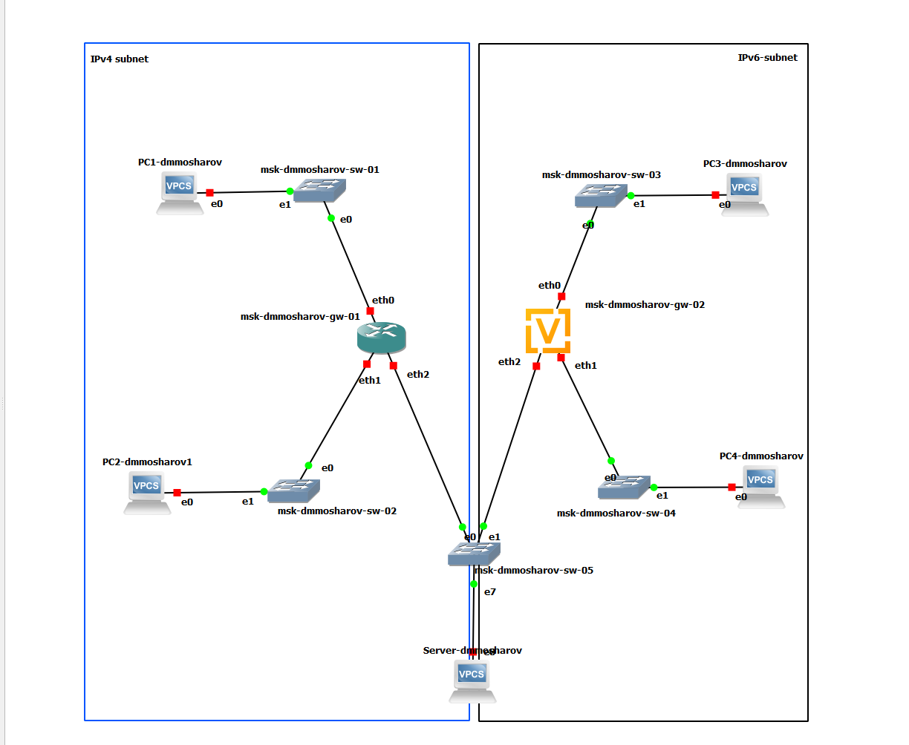{#fig:001}

Включим захват трафика на соединении между сервером (PC5-dmmosharov) и ближайшим коммутатором (msk-dmmosharov-sw-05) для последующего анализа (рис. [-@fig:002]).

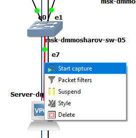{#fig:002}

Выполним настройка IPv4-адресации на устройстве PC1. С помощью команды ip задан адрес 172.16.20.10/25 и шлюз по умолчанию 172.16.20.1, после чего конфигурация сохранена (рис. [-@fig:003]).

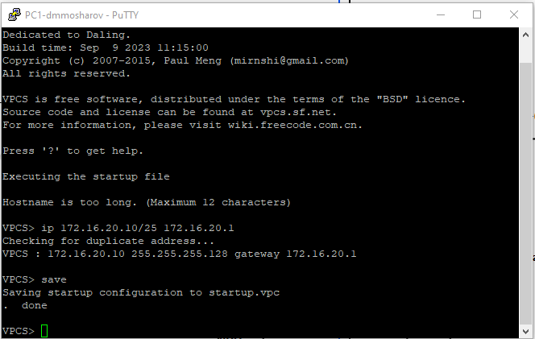{#fig:003}

Произведём настройку сетевых параметров на устройстве PC2. Установлен IP-адрес 172.16.20.138/25 и шлюз 172.16.20.129 (рис. [-@fig:004]).

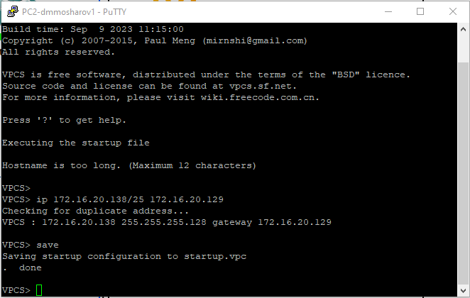{#fig:004}

Настроим IPv4-адресацию на сервере (устройство PC5). Назначен адрес 64.100.1.10 с маской подсети /24 и шлюзом 64.100.1.1 (рис. [-@fig:005]).

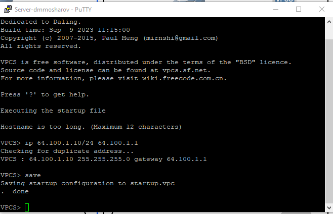{#fig:005}

На виртуальной машине PC1 была проверена конфигурация сетевых интерфейсов с помощью команды show ip и show ipv6. Как видно на скриншоте, устройству корректно присвоен IPv4-адрес 172.16.20.10 с маской /25, а также указан шлюз по умолчанию 172.16.20.1 (рис. [-@fig:006]).

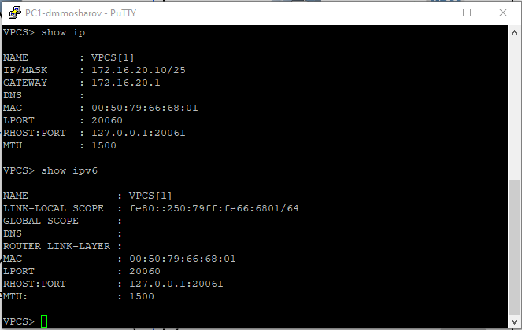{#fig:006}

Аналогичная проверка была выполнена на устройстве PC2. Команда show ip подтверждает, что устройство получило IP-адрес 172.16.20.138/25, а в качестве шлюза по умолчанию установлен адрес 172.16.20.129 (рис. [-@fig:007]).

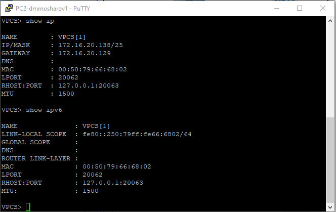{#fig:007}

Далее была выполнена настройка маршрутизатора FRR (msk-dmmosharov-gw-01). В режиме конфигурации были заданы IP-адреса для интерфейсов eth0, eth1 и eth2 в соответствии с таблицей адресации, а также активированы интерфейсы командой no shutdown (рис. [-@fig:008]).

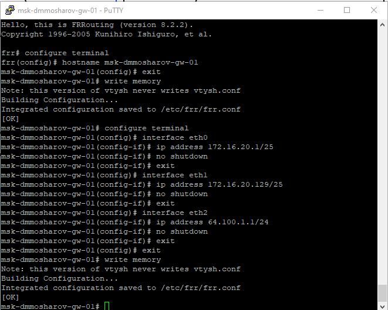{#fig:008}

После завершения настройки была проведена проверка текущей конфигурации маршрутизатора с помощью команды show running-config. Вывод команды подтверждает, что IP-адреса для всех трёх интерфейсов (eth0, eth1, eth2) применены верно (рис. [-@fig:009]).

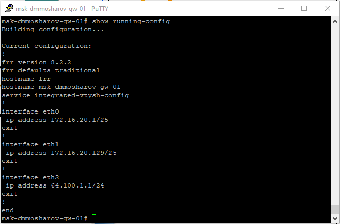{#fig:009}

Для окончательной проверки состояния интерфейсов была использована команда show interface brief. Она показывает, что интерфейсы eth0, eth1 и eth2 находятся в состоянии UP и имеют назначенные IP-адреса (рис. [-@fig:010]).

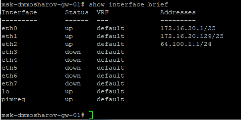{#fig:010}

Проверка сетевой связности в подсети IPv4. С узла PC1 выполним отправку эхо-запросов (ping) и трассировку маршрута (trace) до узла PC2 (172.16.20.138). Успешный результат подтверждает корректность настройки интерфейсов и маршрутизации внутри локальной сети (рис. [-@fig:011]).

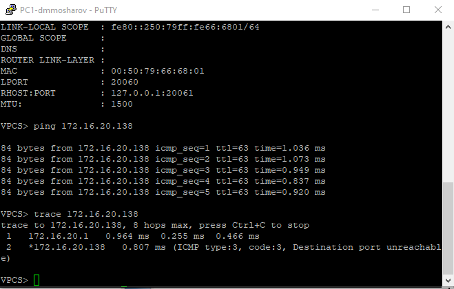{#fig:011}

Проверим доступность сервера двойного стека из подсети IPv4. С узла PC1 выполняется ping и trace до адреса сервера 64.100.1.10. Маршрут проходит через шлюз 172.16.20.1, пакеты успешно доставляются (рис. [-@fig:012]).

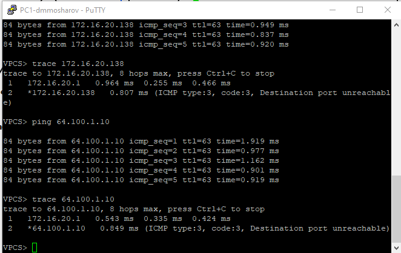{#fig:012}

Начнём адресацию для устройств второй подсети (IPv6). На узле PC3 задается адрес 2001:db8:c0de:12::a с префиксом /64, после чего конфигурация сохраняется (рис. [-@fig:013]).

{#fig:013}

Узлу PC4 присваивается адрес 2001:db8:c0de:13::a/64 в соответствии с таблицей маршрутизации (рис. [-@fig:014]).

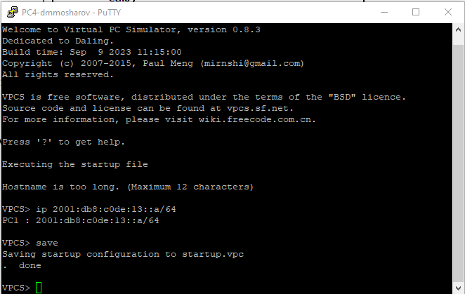{#fig:014}

Устройству сервера двойного стека (Server/PC5) назначается адрес IPv6 (2001:db8:c0de:11::a) (рис. [-@fig:015]).

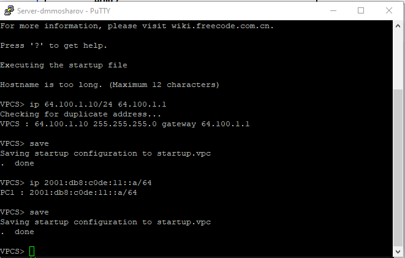{#fig:015}

Далее выполниим проверку конфигурации на устройствах второй подсети (IPv6). На узле PC3 с помощью команды show ipv6 убедимся в наличии корректного глобального адреса 2001:db8:c0de:12::a/64 (рис. [-@fig:016]).

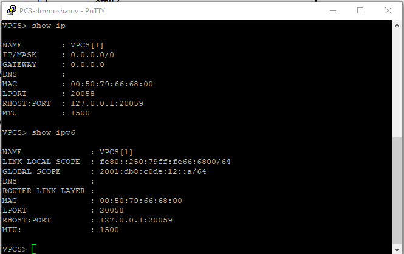{#fig:016}

Аналогичная проверка была выполнена для узла PC4. Команда show ipv6 показала, что интерфейсу присвоен адрес 2001:db8:c0de:13::a/64, что соответствует таблице адресации (рис. [-@fig:017]).

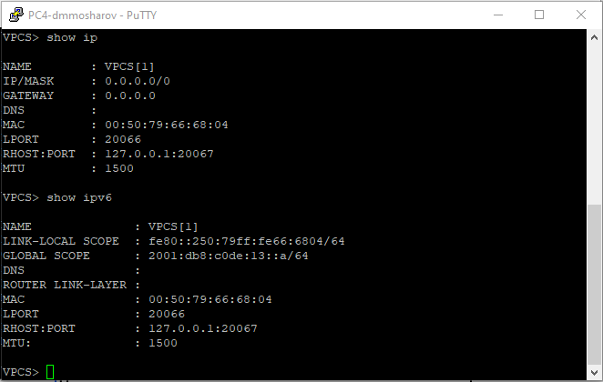{#fig:017}

Затем началась настройка маршрутизатора msk-user-gw-02 под управлением ОС VyOS. В режиме конфигурации изменим имя устройства на msk-dmmosharov-gw-02, изменения были зафиксированы (commit) и сохранены (save), после чего устройство было перезагружено (рис. [-@fig:018]).

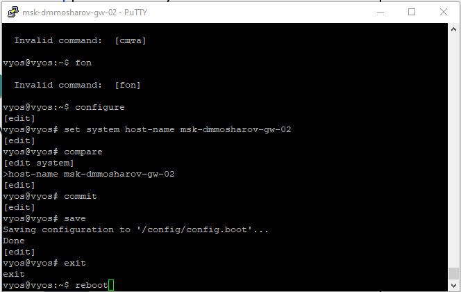{#fig:018}

После перезагрузки была произведена настройка сетевых интерфейсов маршрутизатора. Для интерфейсов eth0, eth1 и eth2 были назначены соответствующие IPv6-адреса согласно заданию, а также включена служба router-advert для рассылки префиксов сети. Конфигурация была проверена командой compare, применена и сохранена (рис. [-@fig:019]).

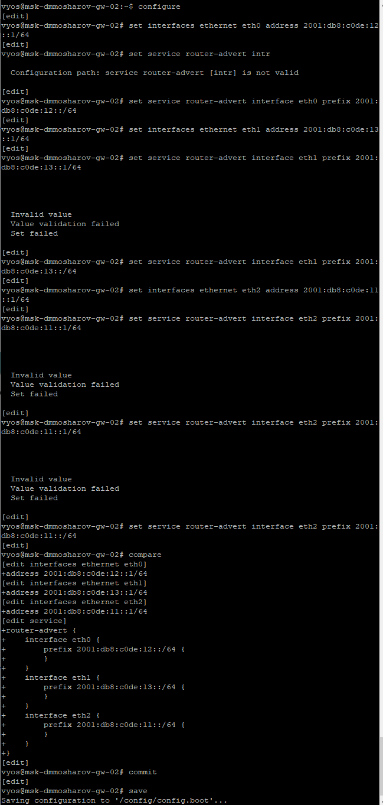{#fig:019}

Для подтверждения корректности настроек была выполнена команда show interfaces, которая отобразила список интерфейсов с назначенными им IPv6-адресами (рис. [-@fig:020]).

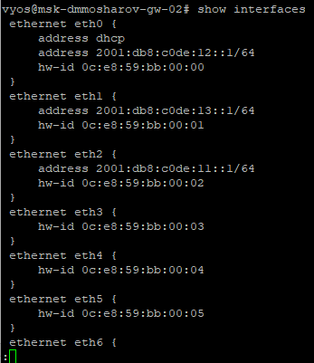{#fig:020}

Проверим подключения между узлами внутри сети IPv6. С узла PC3 выполняется отправка эхо-запросов (ping) и трассировка маршрута (trace) до узла PC4 (адрес 2001:db8:c0de:13::a). Успешный результат подтверждает корректную маршрутизацию внутри сегмента IPv6 (рис. [-@fig:021]).

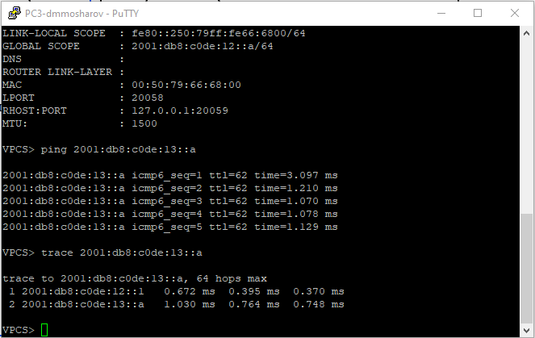{#fig:021}

Проверим доступность сервера двойного стека со стороны сети IPv6. С узла PC3 выполним ping и trace до IPv6-адреса сервера (2001:db8:c0de:11::a). Пакеты успешно доходят через шлюз (рис. [-@fig:022]).

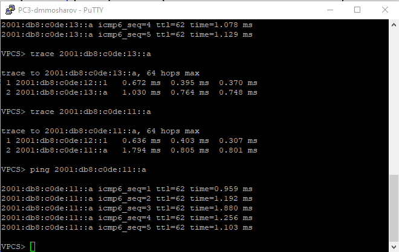{#fig:022}

Проверим подключение со стороны сети IPv4 (узла PC1). Выполняем успешную трассировку и пинг до IPv4-адреса сервера (64.100.1.10). Также попытаемся сделать пинг IPv6-адреса (2001:db8:c0de:12::a), которая завершается неудачей, подтверждая, что устройство IPv4 не может напрямую обращаться к адресам IPv6 (рис. [-@fig:023]).

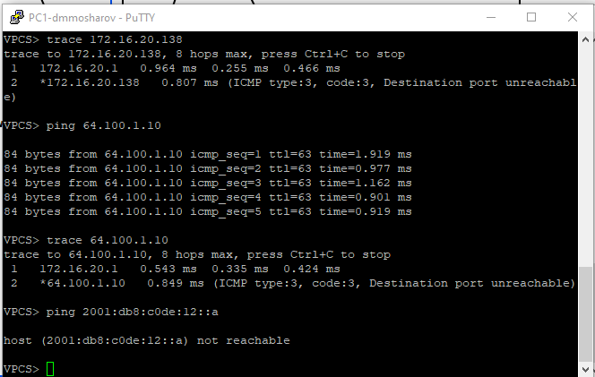{#fig:023}

С узла PC3 (IPv6) Сделаем пинг узла PC1 (адрес 172.16.20.10). Результат «host not reachable» подтверждает выполнение пункта задания о недоступности устройств IPv4 для устройств из подсети IPv6 (рис. [-@fig:024]).

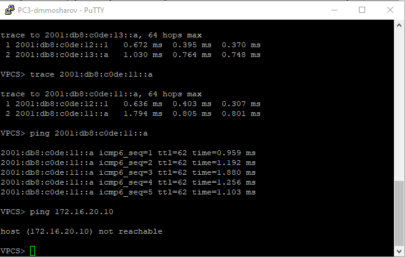{#fig:024}

Сервер же успешно пингует как узел IPv4 (PC1 — 172.16.20.10), так и узел IPv6 (PC3 — 2001:db8:c0de:12::a), что доказывает корректную работу Dual Stack (рис. [-@fig:025]).

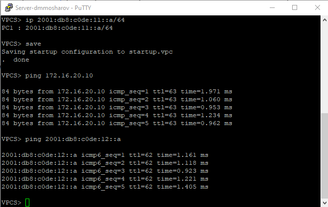{#fig:025}

Произведём анализ сетевого трафика на интерфейсе, соединяющем сервер двойного стека с коммутатором. На скриншоте виден успешный обмен ICMP-пакетами (Ping) по протоколу IPv4 между клиентом (172.16.20.10) и сервером (64.100.1.10). Также зафиксированы ARP-запросы для разрешения MAC-адресов (рис. [-@fig:026]).

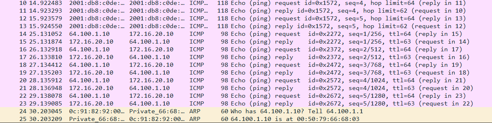{#fig:026}

Проанализируем пакеты по протоколу IPv6. В перехваченном трафике отображаются пакеты ICMPv6 Echo Request и Echo Reply между клиентом (2001:db8:c0de:12::a) и сервером (2001:db8:c0de:11::a). Кроме того, видны сообщения протокола Neighbor Discovery (Neighbor Solicitation и Advertisement), выполняющие функции, аналогичные ARP в IPv4 (рис. [-@fig:027]).

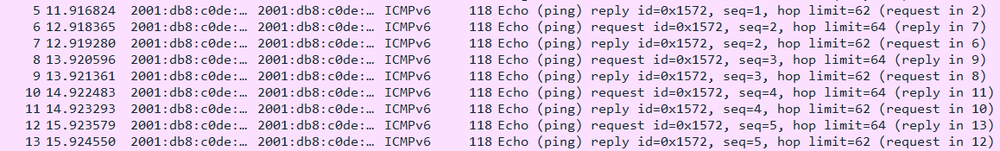{#fig:027}

При дальнейшем анализе трафика IPv4 видим похожую картину, что и до этого (рис. [-@fig:028]).

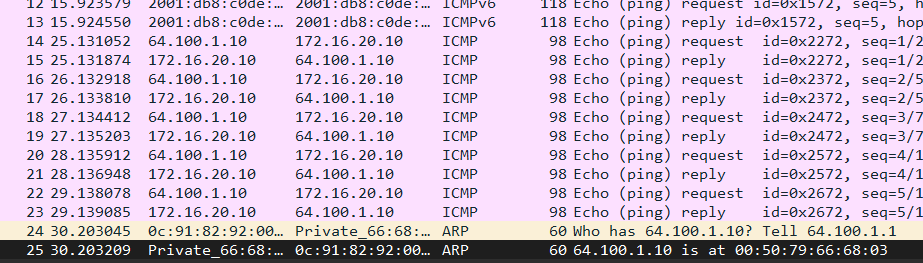{#fig:028}

Дальнейший анализ трафика ipv6 видим похожую картику - обмен echo пакетами и Neighbor Solicitation (рис. [-@fig:029]).

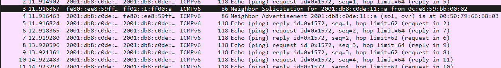{#fig:029}

# Самостоятельная работа

В рамках задания для самостоятельного выполнения была разработана схема адресации для новой топологии. Исходя из требований разбить сеть на две подсети (одна с маской /27, другая с маской /28), была составлена таблица адресации для маршрутизатора и конечных устройств. Для интерфейсов маршрутизатора были выбраны наименьшие адреса в соответствующих подсетях (рис. [-@fig:030]).

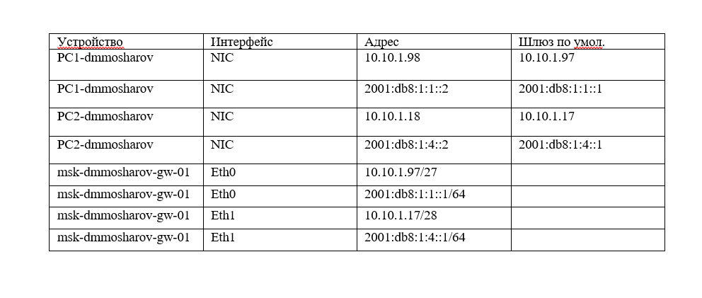{#fig:030}

В рамках задания для самостоятельного выполнения была построена топология сети с двумя локальными подсетями, соединенными маршрутизатором. В качестве маршрутизатора используется VyOS, а в качестве оконечных устройств — VPCS (рис. [-@fig:031]). 

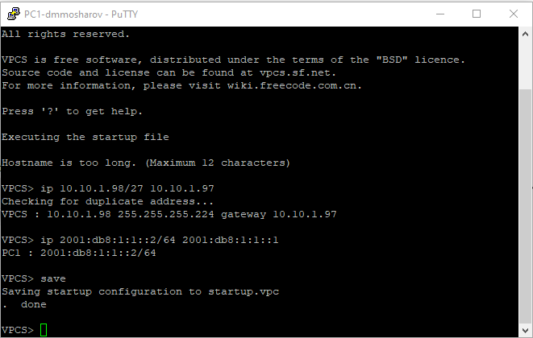{#fig:031}

Далее была выполнена настройка сетевых интерфейсов на оконечных устройствах. Для PC1 были заданы адреса IPv4 и IPv6 из первой подсети, а также указаны шлюзы по умолчанию (рис. [-@fig:032]).

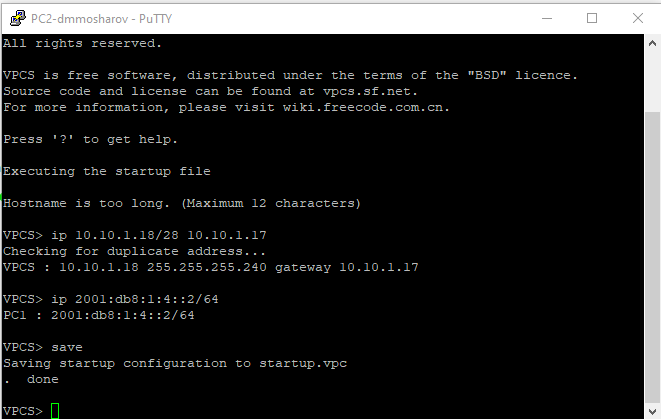{#fig:032}

Аналогичным образом была произведена настройка адресации на PC2, который находится во второй подсети. Ему были присвоены соответствующие адреса и шлюзы (рис. [-@fig:033]).

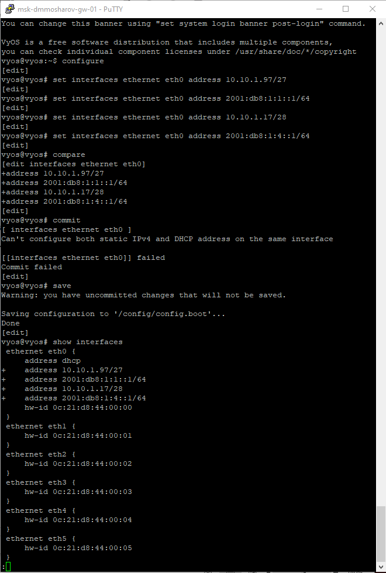{#fig:033}

После настройки хостов переходим к конфигурированию маршрутизатора VyOS. Были введены команды для назначения IP-адресов на интерфейсы eth0 и eth1. Однако при попытке применения конфигурации (commit) возникла ошибка, так как на интерфейсе eth0 был включен DHCP-клиент, конфликтующий со статическим адресом (рис. [-@fig:034]).

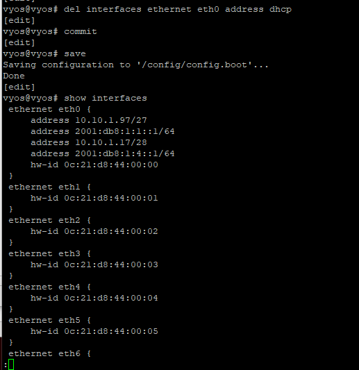{#fig:034}

Для устранения конфликта лишняя настройка DHCP была удалена с интерфейса. После этого изменения были успешно применены и сохранены. Команда show interfaces подтвердила корректность назначения адресов IPv4 и IPv6 на обоих интерфейсах маршрутизатора (рис. [-@fig:035]).

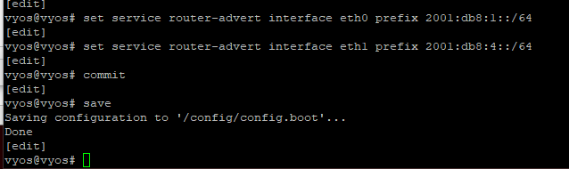{#fig:035}

Настроим службы Router Advertisement на маршрутизаторе VyOS для рассылки префиксов IPv6 сетей 2001:db8:1:1::/64 на интерфейсе eth0 и 2001:db8:1:4::/64 на интерфейсе eth1, с последующим применением и сохранением конфигурации (рис. [-@fig:036]).

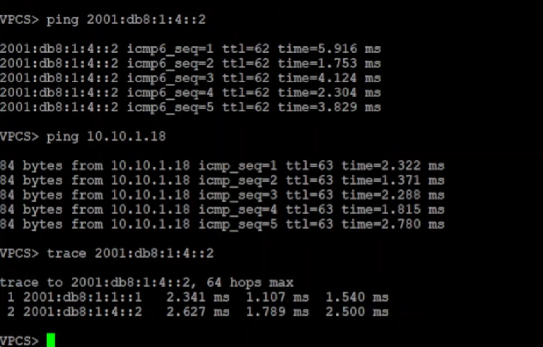{#fig:036}

Проверим доступность узлов во второй подсети с устройства PC1. Успешное выполнение команд ping до IPv6-адреса 2001:db8:1:4::2 и IPv4-адреса 10.10.1.18, а также трассировка маршрута до IPv6-адреса демонстрирует успешное прохождение пакетов через шлюз (рис. [-@fig:037]).

{#fig:037}

# Выводы

В результате выполнения лабораторной работы были получены навыки разработки таблиц адресации, дробления сетей на подсети, настройки адресации и настройке сервера с двойным стеком, также работы с протоколом icmpv6