---
## Front matter
title: "Отчёт о лабораторной работе"
subtitle: "Лабораторная работа 7"
author: "Мошаров Денис Максимович"

## Generic otions
lang: ru-RU
toc-title: "Содержание"

## Bibliography
bibliography: bib/cite.bib
csl: pandoc/csl/gost-r-7-0-5-2008-numeric.csl

## Pdf output format
toc: true # Table of contents
toc-depth: 2
lof: true # List of figures
lot: true # List of tables
fontsize: 12pt
linestretch: 1.5
papersize: a4
documentclass: scrreprt
## I18n polyglossia
polyglossia-lang:
  name: russian
  options:
	- spelling=modern
	- babelshorthands=true
polyglossia-otherlangs:
  name: english
## I18n babel
babel-lang: russian
babel-otherlangs: english
## Fonts
mainfont: IBM Plex Serif
romanfont: IBM Plex Serif
sansfont: IBM Plex Sans
monofont: IBM Plex Mono
mathfont: STIX Two Math
mainfontoptions: Ligatures=Common,Ligatures=TeX,Scale=0.94
romanfontoptions: Ligatures=Common,Ligatures=TeX,Scale=0.94
sansfontoptions: Ligatures=Common,Ligatures=TeX,Scale=MatchLowercase,Scale=0.94
monofontoptions: Scale=MatchLowercase,Scale=0.94,FakeStretch=0.9
mathfontoptions:
## Biblatex
biblatex: true
biblio-style: "gost-numeric"
biblatexoptions:
  - parentracker=true
  - backend=biber
  - hyperref=auto
  - language=auto
  - autolang=other*
  - citestyle=gost-numeric
## Pandoc-crossref LaTeX customization
figureTitle: "Рис."
tableTitle: "Таблица"
listingTitle: "Листинг"
lofTitle: "Список иллюстраций"
lotTitle: "Список таблиц"
lolTitle: "Листинги"
## Misc options
indent: true
header-includes:
  - \usepackage{indentfirst}
  - \usepackage{float} # keep figures where there are in the text
  - \floatplacement{figure}{H} # keep figures where there are in the text
---

# Цель работы

Получение навыков настройки службы DHCP на сетевом оборудовании для распределения адресов IPv4 и IPv6.

# Выполнение работы

Создаю новый проект в GNS3 и дадим ему имя project4(lab07). (рис. [-@fig:001]).

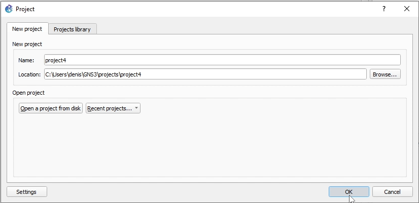{#fig:001}

Соберем топологию сети для первой части задания (IPv4). Она состоит из виртуального ПК (VPCS), коммутатора и маршрутизатора VyOS. (рис. [-@fig:002]).

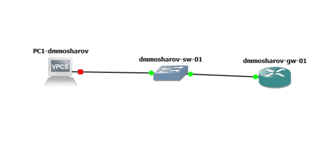{#fig:002}

Перед началом настройки запустим захват трафика (Wireshark) на соединении между коммутатором и маршрутизатором. (рис. [-@fig:003]).

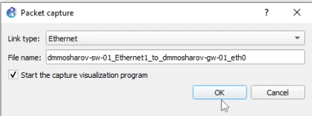{#fig:003}

Зайдем в консоль маршрутизатора VyOS. Выполним базовую настройку системы: зададим имя хоста dmmosharov-gw-01, доменное имя и создадим пользователя dmmosharov. (рис. [-@fig:004]).

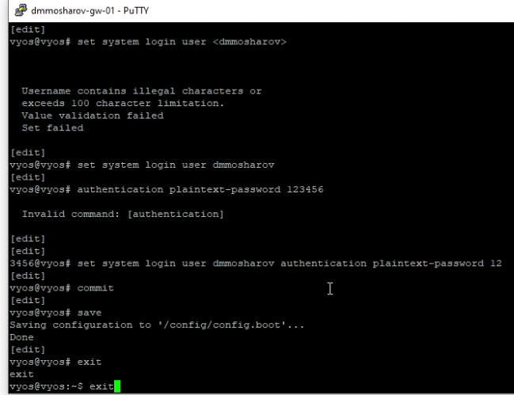{#fig:004}

удаляю стандартного пользователя vyos и сохраним конфигурацию. (рис. [-@fig:005]).

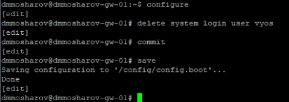{#fig:005}

Приступаю к настройке интерфейсов и DHCP. Назначаю интерфейсу eth0 адрес 10.0.0.1/24. Затем настраиваю службу DHCP: нужна разделяемая сеть с именем dmmosharov, определим подсеть 10.0.0.0/24, шлюз по умолчанию, DNS-сервер и зададим диапазон выдаваемых адресов с 10.0.0.2 по 10.0.0.253. (рис. [-@fig:006]).

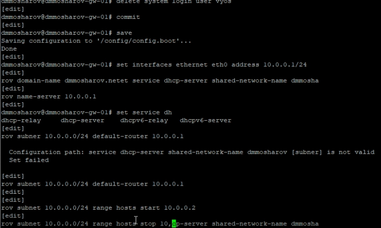{#fig:006}

Проверим текущую статистику DHCP-сервера командой show dhcp server statistics. Мы видим, что размер пула составляет 252 адреса (Leases: 0). (рис. [-@fig:007]).

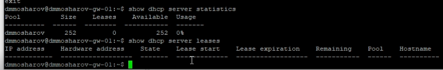{#fig:007}

Перейдем к клиенту VPCS (PC1) и запросим получение адреса по DHCP с помощью команды ip dhcp -d. Флаг -d позволяет увидеть подробный вывод процесса DORA (Discover, Offer, Request, Acknowledge). Клиент успешно получил адрес 10.0.0.2. (рис. [-@fig:008]).

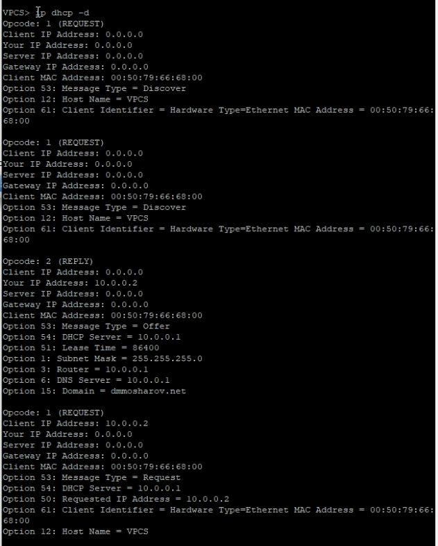{#fig:008}

Вернемся на маршрутизатор и снова проверим статистику и список арендованных адресов. Теперь мы видим одну активную аренду для IP-адреса 10.0.0.2, привязанную к MAC-адресу нашего PC1. (рис. [-@fig:009]).

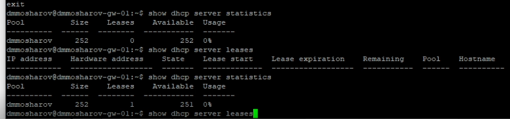{#fig:009}

Посмотрим системные логи маршрутизатора, отфильтровав их по строке dhcp. Это позволяет увидеть сообщения службы DHCP о запуске и работе. (рис. [-@fig:010]).

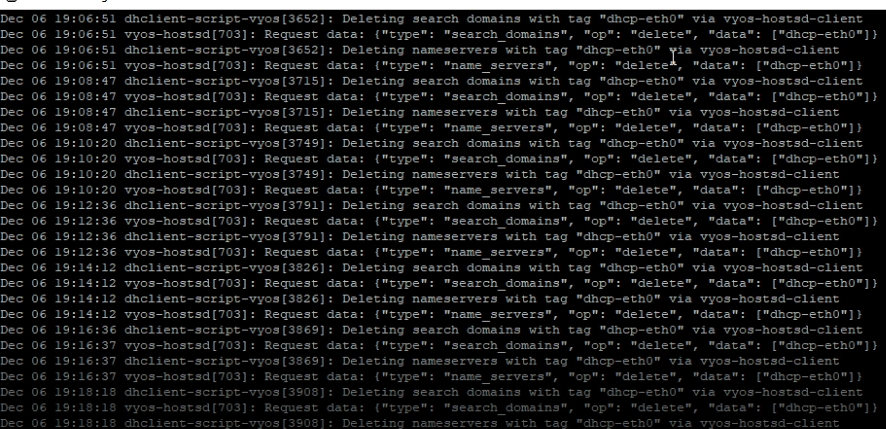{#fig:010}

При более детальном рассмотрении логов мы можем наблюдать записи о получении запросов от клиента: DHCPDISCOVER, отправке предложения DHCPOFFER, получении запроса DHCPREQUEST и подтверждении DHCPACK. (рис. [-@fig:011]).

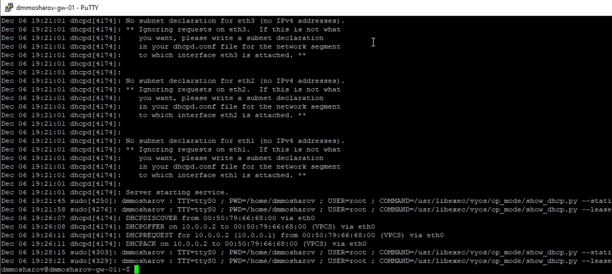{#fig:011}

Проанализируем захваченный трафик в Wireshark. Мы видим классическую схему обмена из четырех пакетов:   
DHCP Discover (Broadcast) — клиент ищет сервер, DHCP Offer (Unicast) — сервер предлагает IP 10.0.0.2., DHCP Request (Broadcast) — клиент подтверждает желание использовать этот IP., DHCP ACK (Unicast) — сервер закрепляет адрес за клиентом.   
(рис. [-@fig:012]).

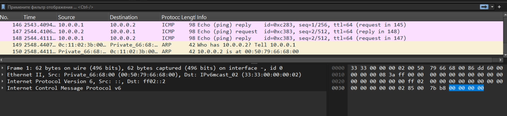{#fig:012}

Переходим ко второй части работы — настройке IPv6. Расширим топологию, добавив два клиента на базе Kali Linux и соответствующие коммутаторы. (рис. [-@fig:013]).

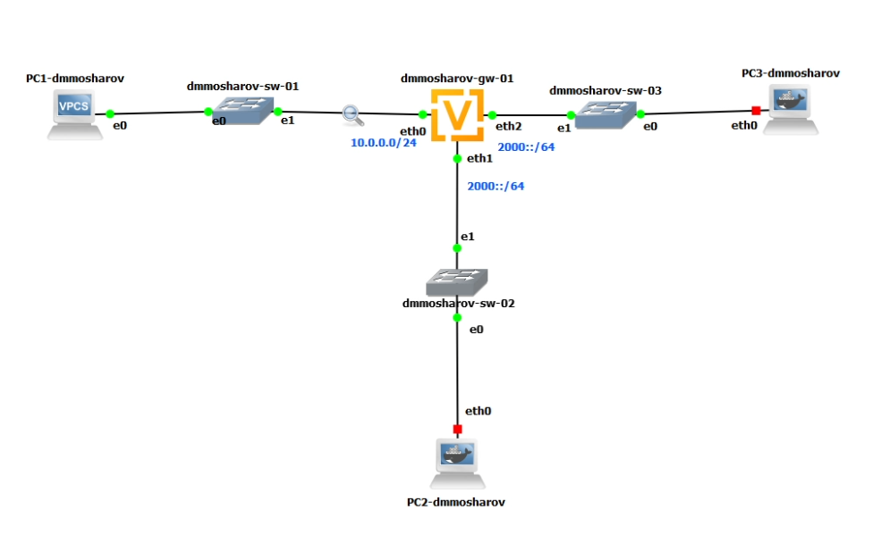{#fig:013}

Настроим IPv6 адреса на интерфейсах маршрутизатора: 2000::1/64 на eth1 и 2001::1/64 на eth2. (рис. [-@fig:014]).

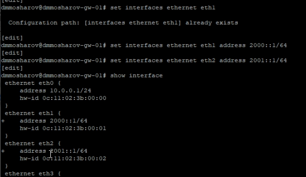{#fig:014}

Настроим DHCPv6 без отслеживания состояния (Stateless) для интерфейса eth1. Для этого в объявлениях маршрутизатора (RA) установим флаг other-config-flag (клиент получает адрес через SLAAC, а остальные настройки через DHCPv6). В конфигурации DHCPv6 сервера зададим только общие опции (например, DNS-сервер), без указания диапазона адресов. (рис. [-@fig:015]).

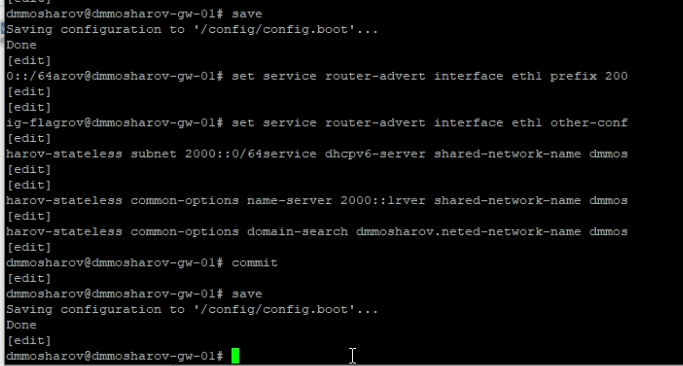{#fig:015}

Проверим итоговую конфигурацию маршрутизатора с помощью команды show configuration, чтобы убедиться в правильности введенных команд. (рис. [-@fig:016]).

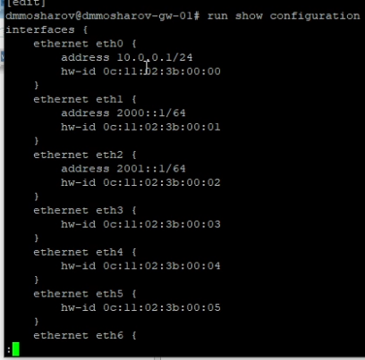{#fig:016}

На клиенте PC2 (подключен к eth1) проверим сетевые настройки. Команда ifconfig показывает, что интерфейс автоматически получил глобальный IPv6 адрес из сети 2000::/64. Таблица маршрутизации корректна, пинг проходит. (рис. [-@fig:017]).

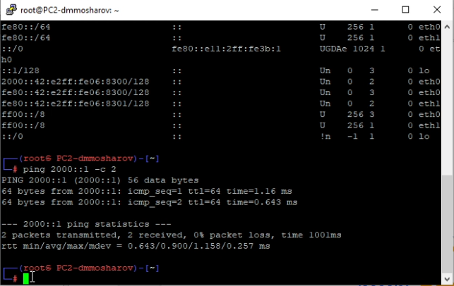{#fig:017}

Проверим DNS. Изначально файл /etc/resolv.conf пуст. Запустим DHCP-клиент в режиме stateless (запрос только информации) командой dhclient -6 -S -v eth0. После выполнения команды в /etc/resolv.conf появляется запись nameserver 2000::1, полученная от сервера. (рис. [-@fig:018]).

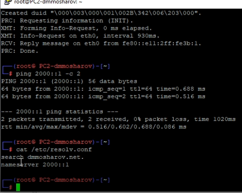{#fig:018}

На маршрутизаторе проверим список выданных адресов DHCPv6. Список пуст, так как в режиме Stateless сервер не выдает адреса, а лишь предоставляет дополнительную конфигурацию. (рис. [-@fig:019]).

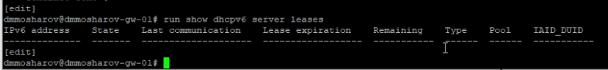{#fig:019}

В Wireshark проанализируем обмен пакетами для Stateless DHCPv6. Мы видим пакеты Information-request (клиент запрашивает информацию) и Reply (сервер отправляет данные). Это отличается от полного процесса получения адреса. (рис. [-@fig:020]).

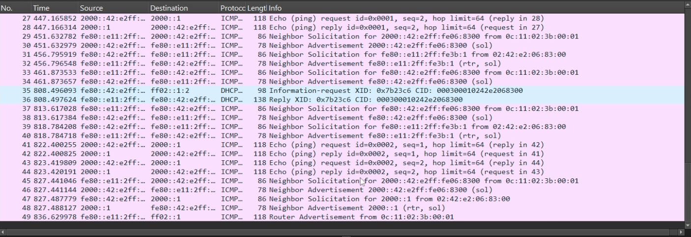{#fig:020}

Теперь настроим DHCPv6 с отслеживанием состояния (Stateful) для интерфейса eth2. В RA установим флаг managed-flag (адреса управляются сервером). Создадим конфигурацию DHCPv6 сервера с пулом адресов от 2001::100 до 2001::199 и передачей DNS-сервера. (рис. [-@fig:021]).

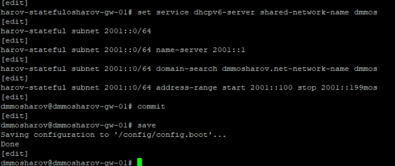{#fig:021}

Проверим таблицу аренды перед подключением клиента — она пуста. (рис. [-@fig:022]).

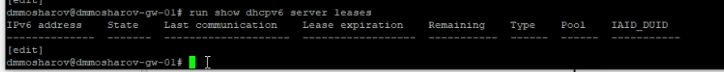{#fig:022}

Перейдем к клиенту PC3 (подключен к eth2). Проверим начальное состояние интерфейсов. Пока глобальный адрес не получен. (рис. [-@fig:023]).

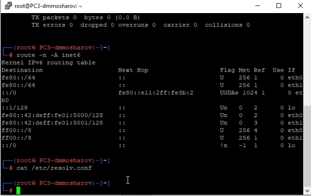{#fig:023}

Запустим получение адреса командой dhclient -6 -v eth0 (без флага -S). В выводе мы видим полный процесс обмена сообщениями (Solicit, Advertise, Request, Reply) и получение адреса 2001::199. (рис. [-@fig:024]).

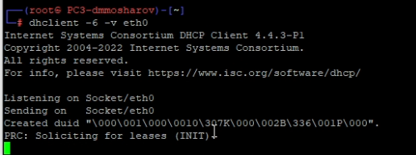{#fig:024}

Убедимся, что адрес 2001::199 назначен интерфейсу, маршруты настроены, пинг до шлюза 2001::1 проходит успешно, а DNS-сервер прописан в конфигурации. (рис. [-@fig:025]).

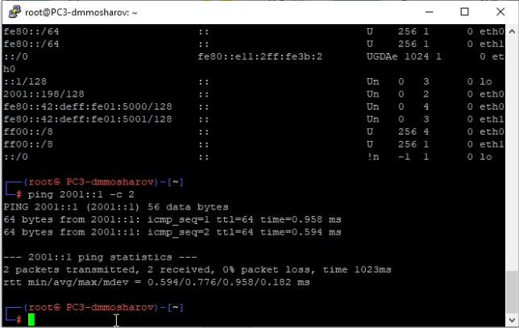{#fig:025}

Снова проверим таблицу аренды на маршрутизаторе. Теперь мы видим активную запись для адреса 2001::199, выданного нашему клиенту PC3. (рис. [-@fig:026]).

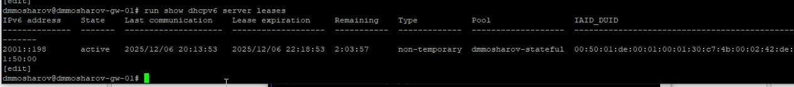{#fig:026}

В Wireshark проанализируем захваченные пакеты Stateful DHCPv6. Мы отчетливо наблюдаем четыре этапа обмена:   
1.  Solicit — клиент ищет серверы.   
2.  Advertise — сервер объявляет о своем наличии.   
3.  Request — клиент запрашивает выделение адреса.   
4.  Reply — сервер подтверждает выдачу адреса и опций.   
(рис. [-@fig:027]).

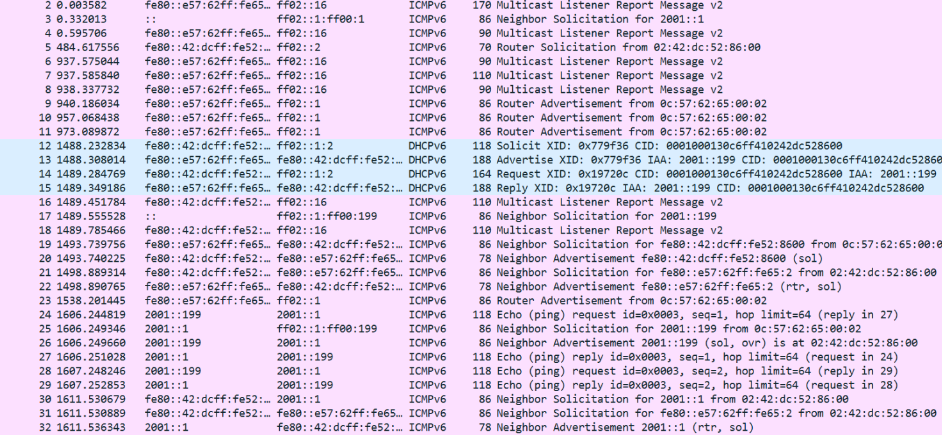{#fig:027}

# Выводы

В результате выполнения лабораторной работы были получены навыки использования и настройки dhcpv6