---
## Front matter
title: "Отчёт о лабораторной работе"
subtitle: "Лабораторная работа 8"
author: "Мошаров Денис Максимович"

## Generic otions
lang: ru-RU
toc-title: "Содержание"

## Bibliography
bibliography: bib/cite.bib
csl: pandoc/csl/gost-r-7-0-5-2008-numeric.csl

## Pdf output format
toc: true # Table of contents
toc-depth: 2
lof: true # List of figures
lot: true # List of tables
fontsize: 12pt
linestretch: 1.5
papersize: a4
documentclass: scrreprt
## I18n polyglossia
polyglossia-lang:
  name: russian
  options:
	- spelling=modern
	- babelshorthands=true
polyglossia-otherlangs:
  name: english
## I18n babel
babel-lang: russian
babel-otherlangs: english
## Fonts
mainfont: IBM Plex Serif
romanfont: IBM Plex Serif
sansfont: IBM Plex Sans
monofont: IBM Plex Mono
mathfont: STIX Two Math
mainfontoptions: Ligatures=Common,Ligatures=TeX,Scale=0.94
romanfontoptions: Ligatures=Common,Ligatures=TeX,Scale=0.94
sansfontoptions: Ligatures=Common,Ligatures=TeX,Scale=MatchLowercase,Scale=0.94
monofontoptions: Scale=MatchLowercase,Scale=0.94,FakeStretch=0.9
mathfontoptions:
## Biblatex
biblatex: true
biblio-style: "gost-numeric"
biblatexoptions:
  - parentracker=true
  - backend=biber
  - hyperref=auto
  - language=auto
  - autolang=other*
  - citestyle=gost-numeric
## Pandoc-crossref LaTeX customization
figureTitle: "Рис."
tableTitle: "Таблица"
listingTitle: "Листинг"
lofTitle: "Список иллюстраций"
lotTitle: "Список таблиц"
lolTitle: "Листинги"
## Misc options
indent: true
header-includes:
  - \usepackage{indentfirst}
  - \usepackage{float} # keep figures where there are in the text
  - \floatplacement{figure}{H} # keep figures where there are in the text
---

# Цель работы

Изучить принципы маршрутизации в IPv4- и IPv6-сетях и принципы настройки сетевого оборудования.

# Выполнение лабораторной работы

Создаём новый проект в GNS3 с названием "lab8" (рис. [-@fig:001]).

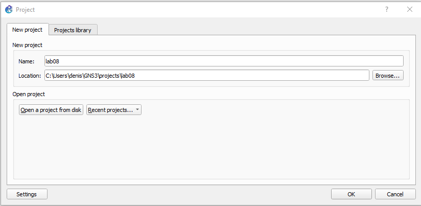{#fig:001}

Выстраиваем топологию сети, согласно данному заданию, размещаем коммутаторы, маршрутизаторы FRR и оконечные устройства (рис. [-@fig:002]).

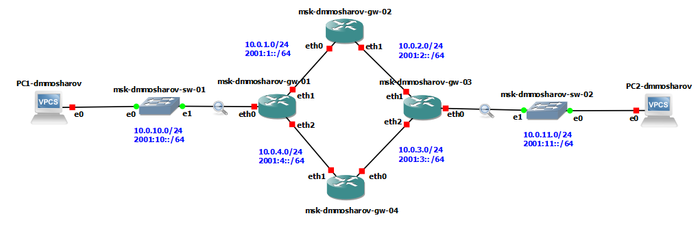{#fig:002}

Настраиваем IP-адрес и шлюз по умолчанию на PC1 10.0.10.10/24 10.0.10.1 (рис. [-@fig:003]).

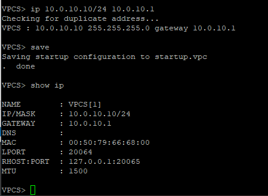{#fig:003}

Настраиваем IP-адрес и шлюз по умолчанию на PC2 ip 10.0.11.10/24 10.0.11.1 (рис. [-@fig:004]).

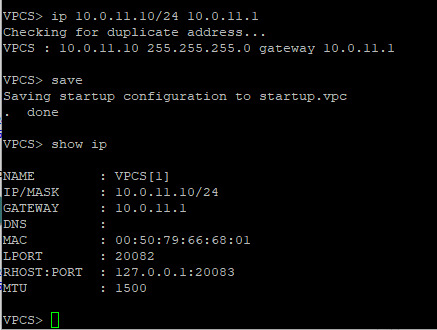{#fig:004}

Настроим IPv4-адреса на интерфейсах маршрутизаторов:
msk-dmmosharov-gw-01 (рис. [-@fig:005]).

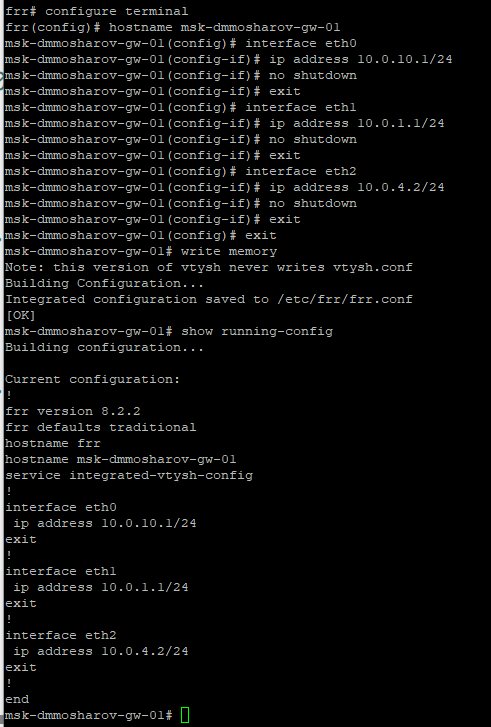{#fig:005}

Настроим IPv4-адреса на интерфейсах маршрутизаторов:
msk-dmmosharov-gw-02 (рис. [-@fig:006]).

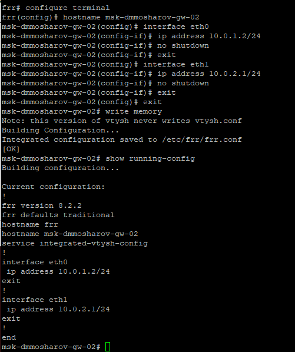{#fig:006}

Настроим IPv4-адреса на интерфейсах маршрутизаторов:
msk-dmmosharov-gw-03 (рис. [-@fig:007]).

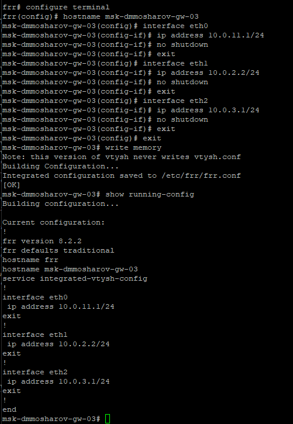{#fig:007}

Настроим IPv4-адреса на интерфейсах маршрутизаторов:
msk-dmmosharov-gw-04  (рис. [-@fig:008]).

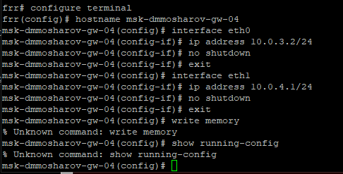{#fig:008}

Присваиваем IPv6-адреса оконечным устройствам PC1 и PC2 в соответствии с данными в таблице  (рис. [-@fig:009]).

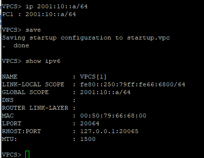{#fig:009}

Проделываем тоже самое для PC2 (рис. [-@fig:010]).

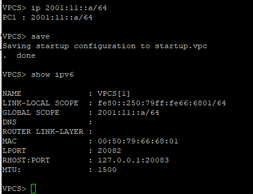{#fig:010}

Настраиваем IPv6-адреса на интерфейсах маршрутизаторов:
msk-dmmosharov-gw-01 (рис. [-@fig:011]).

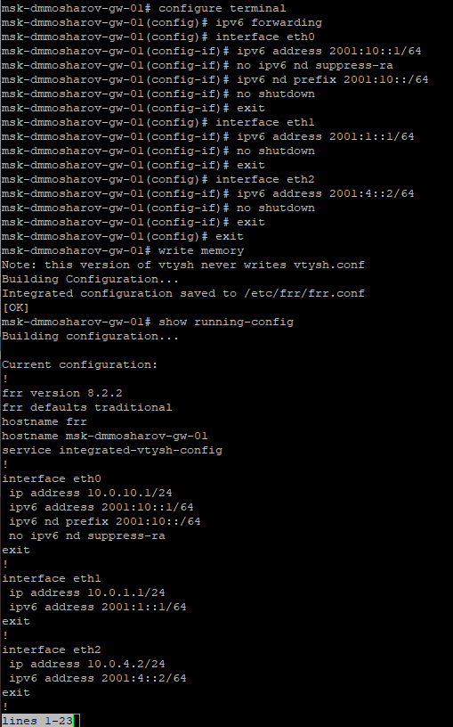{#fig:011}

Настраиваем IPv6-адреса на интерфейсах маршрутизаторов:
msk-dmmosharov-gw-02 (рис. [-@fig:011.1]).

{#fig:011.1}

Настраиваем IPv6-адреса на интерфейсах маршрутизаторов:
msk-dmmosharov-gw-03 (рис. [-@fig:012]).

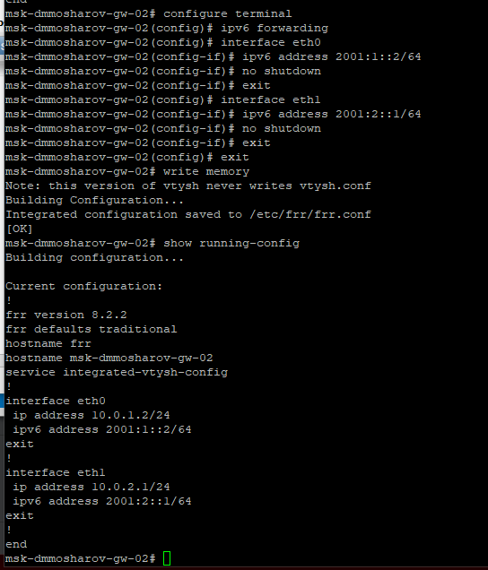{#fig:012}

Настраиваем IPv6-адреса на интерфейсах маршрутизаторов:
msk-dmmosharov-gw-04 (рис. [-@fig:013]).

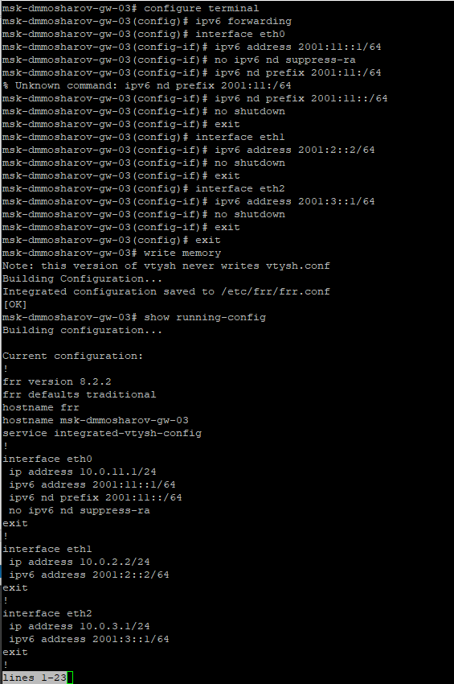{#fig:013}

Настроим RIP на маршрутизаторах в качестве протокола динамической маршрутизации на каждом из msk-dmmosharov-gw-0* (рис. [-@fig:014]).

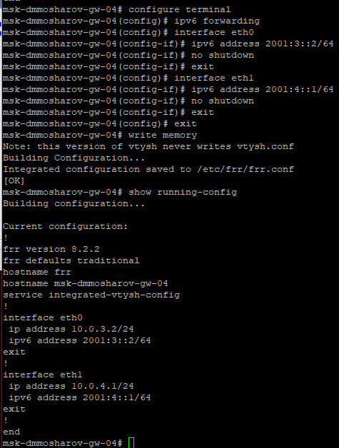{#fig:014}

Также протокол RIP версии 2 на следующем маршрутизаторе (рис. [-@fig:015]).

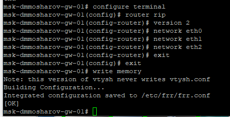{#fig:015}

Также протокол RIP версии 2 на следующем маршрутизаторе (рис. [-@fig:016]).

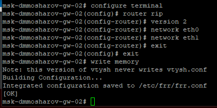{#fig:016}

Также протокол RIP версии 2 на следующем маршрутизаторе (рис. [-@fig:017]).

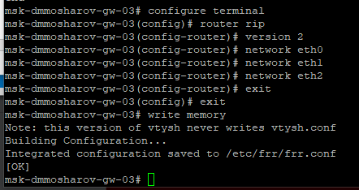{#fig:017}

Выведя статус защиты SSH убеждаемся, что бан был снят (рис. [-@fig:018]).

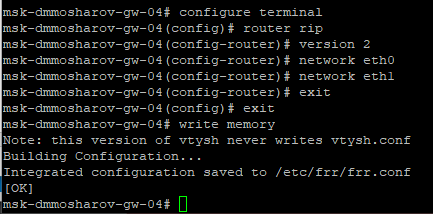{#fig:018}

Убеждаемся, что маршрутизация по RIP настроена на каждом маршрутизаторе (рис. [-@fig:019]).

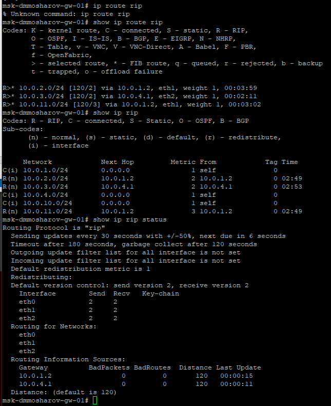{#fig:019}

Проверяем gw-02 (рис. [-@fig:020]).

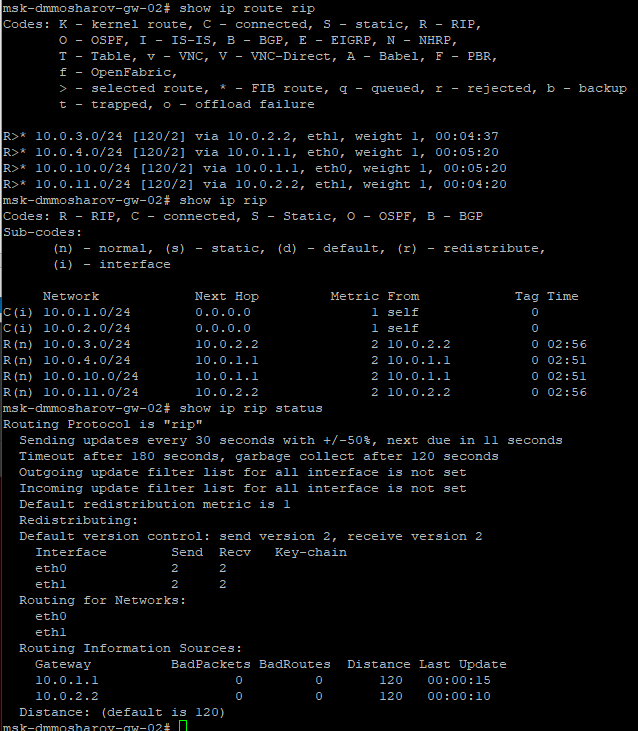{#fig:020}

Проверка gw-03 (рис. [-@fig:021]).

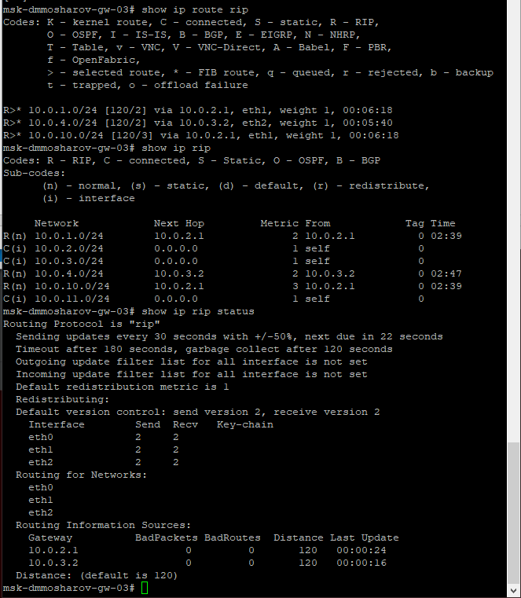{#fig:021}

Проверка gw-04 (рис. [-@fig:022]).

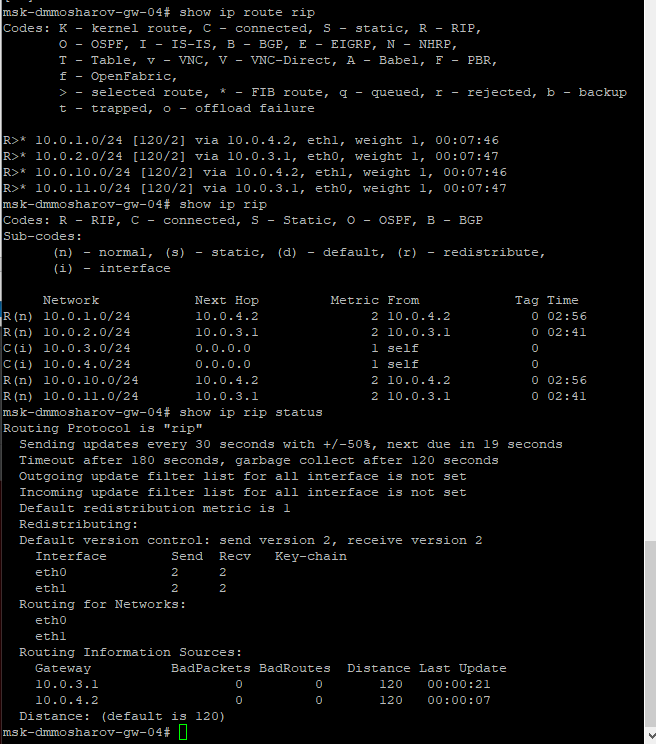{#fig:022}

Проверим пути прохождения пакетов, с PC1 пингуем PC2 (рис. [-@fig:023]).

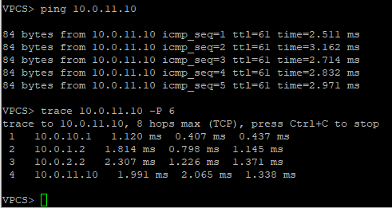{#fig:023}

Проверяем метрики протокола RIP на gw-01 (рис. [-@fig:024]).

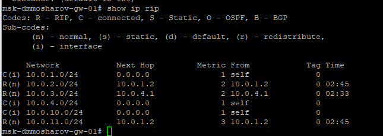{#fig:024}

Отключаем на маршрутизаторе gw-02 интерфейс (рис. [-@fig:025]).

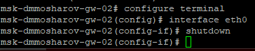{#fig:025}

Проверяем метрики протокола RIP на gw-01 (рис. [-@fig:026]).

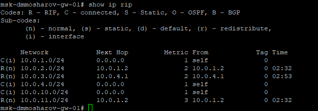{#fig:026}

С PC1 пингуем PC2 и определяем (рис. [-@fig:027]).

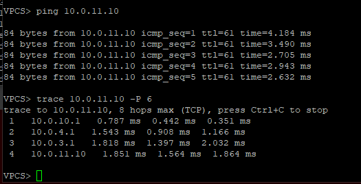{#fig:027}

Включим на маршрутизаторе msk-user-dmmosharov-02 интерфейс (рис. [-@fig:028]).

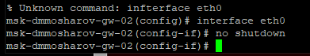{#fig:028}

С PC1 пропингуем PC2 и определим путь следования пакетов (рис. [-@fig:029]).

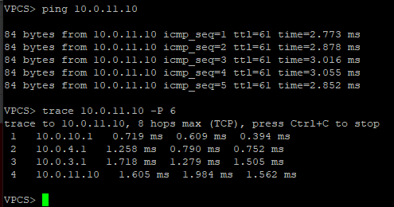{#fig:029}

Посмотрим захваченный на соединениях трафик (рис. [-@fig:030]).

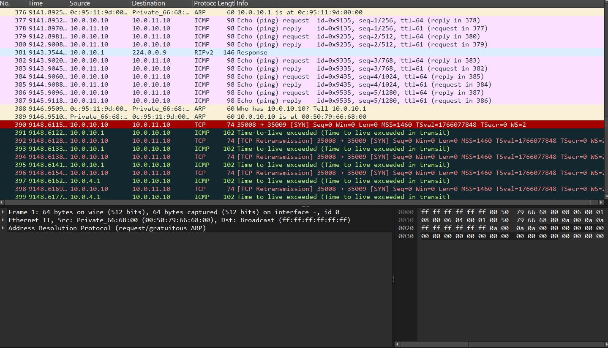{#fig:030}
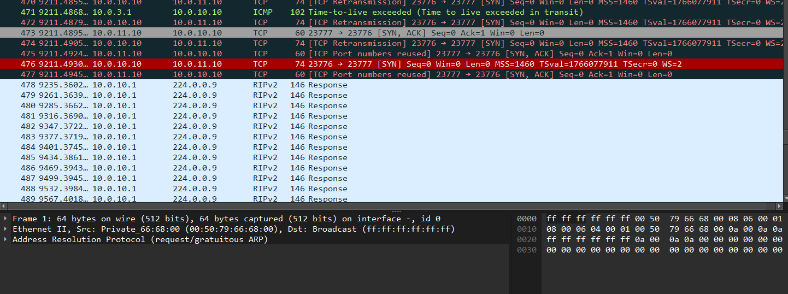{#fig:031}

На маршрутизаторах настроим RIPng для сетей IPv6:
msk-dmmosharov-gw-01 (рис. [-@fig:032]).

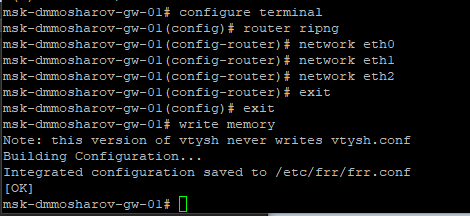{#fig:032}

На маршрутизаторах настроим RIPng для сетей IPv6:
msk-dmmosharov-gw-02 (рис. [-@fig:033]).

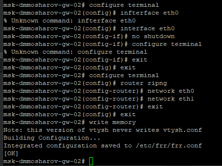{#fig:033}

На маршрутизаторах настроим RIPng для сетей IPv6:
msk-dmmosharov-gw-03 (рис. [-@fig:034]).

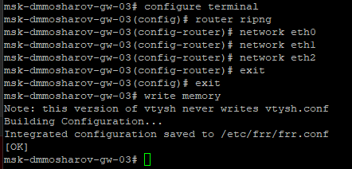{#fig:034}

На маршрутизаторах настроим RIPng для сетей IPv6:
msk-dmmosharov-gw-04 (рис. [-@fig:035]).

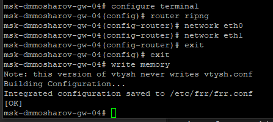{#fig:035}

Проверим пути прохождения пакетов. С PC1 пропингуем PC2 и определим путь следования пакетов (рис. [-@fig:036]).

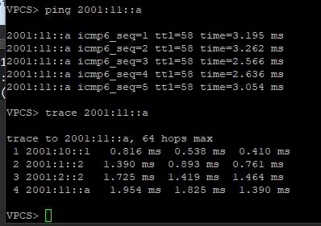{#fig:036}

Проверим метрики протокола RIPng (рис. [-@fig:037]).

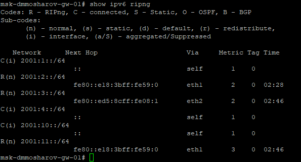{#fig:037}

Отключим на маршрутизаторе msk-dmmosharov-gw-02 интерфейс (рис. [-@fig:038]).

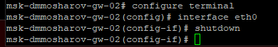{#fig:038}

Проверим метрики протокола RIPng (рис. [-@fig:039]).

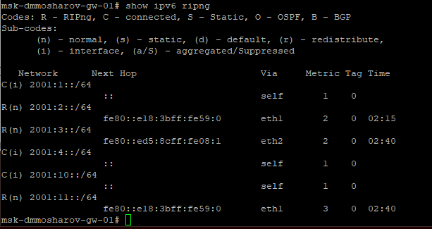{#fig:039}

Посмотрим захваченный на соединениях трафик (рис. [-@fig:040]).

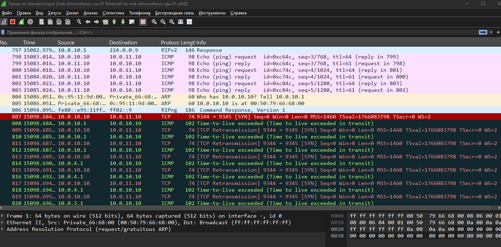{#fig:040}
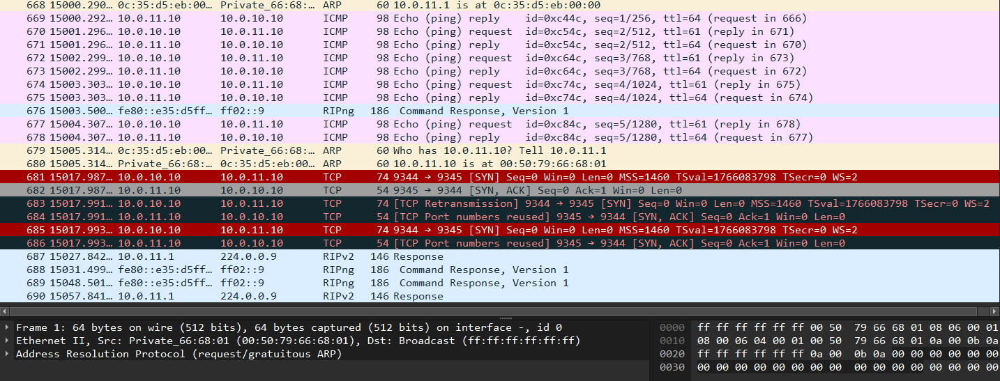{#fig:041}
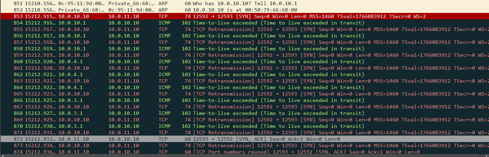{#fig:042}

На маршрутизаторах настроим OSPFv2 для сетей IPv4: msk-dmmosharov-gw-01 (рис. [-@fig:043]).

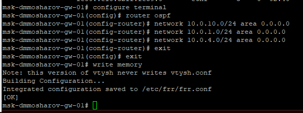{#fig:043}

На маршрутизаторах настроим OSPFv2 для сетей IPv4: msk-dmmosharov-gw-02 (рис. [-@fig:044]).

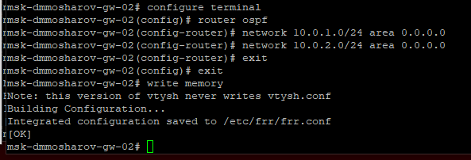{#fig:044}

На маршрутизаторах настроим OSPFv2 для сетей IPv4: msk-dmmosharov-gw-03 (рис. [-@fig:045]).

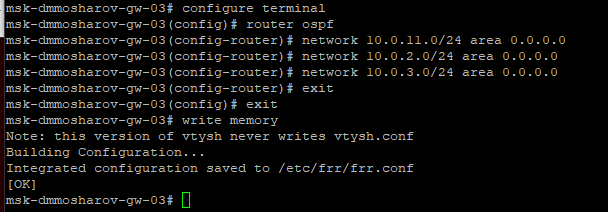{#fig:045}

На маршрутизаторах настроим OSPFv2 для сетей IPv4: msk-dmmosharov-gw-04 (рис. [-@fig:046]).

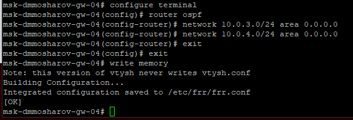{#fig:046}

С PC1 пропингуем PC2 и определим путь следования пакетов (рис. [-@fig:047]).

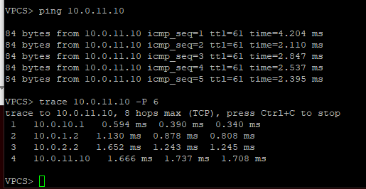{#fig:047}

Проверим таблицу маршрутизации протокола (рис. [-@fig:048]).

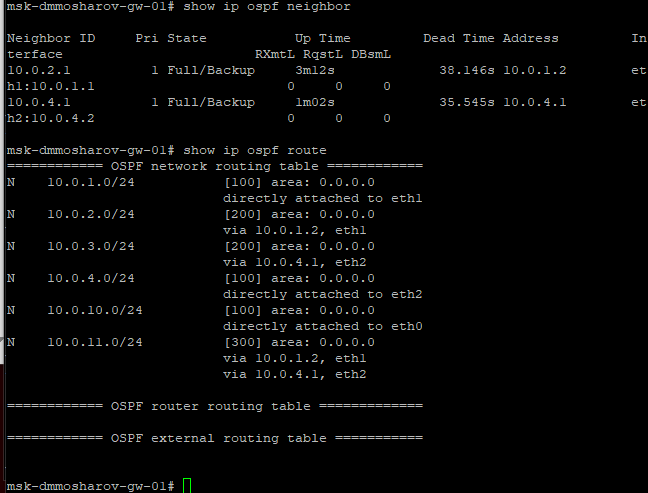{#fig:048}

С PC1 пропингуем PC2 и определим путь следования пакетов (рис. [-@fig:050]).

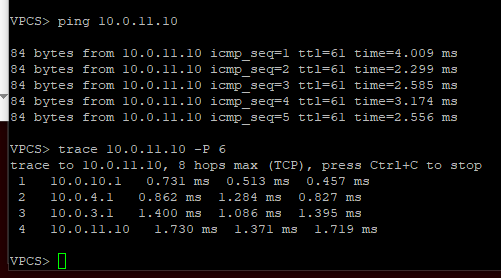{#fig:050}

Включим на маршрутизаторе msk-dmmosharov-gw-02 интерфейс (рис. [-@fig:051]).

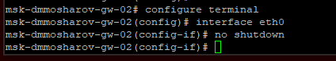{#fig:051}

Посмотрим захваченный на соединениях трафик (рис. [-@fig:052]).

{#fig:052}

На маршрутизаторах настроим OSPFv3 для сетей IPv6: msk-dmmosharov-gw-01 (рис. [-@fig:053]).

{#fig:053}

На маршрутизаторах настроим OSPFv3 для сетей IPv6: msk-dmmosharov-gw-02 (рис. [-@fig:054]).

{#fig:054}

На маршрутизаторах настроим OSPFv3 для сетей IPv6: msk-dmmosharov-gw-03 (рис. [-@fig:055]).

{#fig:055}

На маршрутизаторах настроим OSPFv3 для сетей IPv6: msk-dmmosharov-gw-04 (рис. [-@fig:056]).

{#fig:056}

С PC1 пропингуем PC2 и определим путь следования пакетов (рис. [-@fig:057]).

{#fig:057}

Проверим таблицу маршрутизации протокола (рис. [-@fig:058]).

{#fig:058}

С PC1 пропингуем PC2 и определим путь следования пакетов  (рис. [-@fig:060]).

{#fig:060}

Посмотрим захваченный трафик (рис. [-@fig:061]).

{#fig:061}

Создадим проект в GNS3. Разместим и соеденим устройства в соответсвии с топологией. (рис. [-@fig:062]).

{#fig:062}

Присвоим адреса оконечным устройствам (рис. [-@fig:063]).

{#fig:063}

Присвоим адреса оконечным устройствам (рис. [-@fig:064]).

{#fig:064}

На маршрутизаторах перейдем в режим конфигурирования и изменим имя устройства (рис. [-@fig:065]).

{#fig:065}

На маршрутизаторах перейдем в режим конфигурирования и изменим имя устройства (рис. [-@fig:066]).

{#fig:066}

На маршрутизаторах перейдем в режим конфигурирования и изменим имя устройства (рис. [-@fig:067]).

{#fig:067}

Настроим адреса на интерфейсах маршрутизаторов (рис. [-@fig:068]).

{#fig:068}

Настроим адреса на интерфейсах маршрутизаторов (рис. [-@fig:069]).

{#fig:069}

Настроим адреса на интерфейсах маршрутизаторов (рис. [-@fig:070]).

{#fig:070}

Убедимся, что появились адреса ближайших к ним маршрутизаторов (рис. [-@fig:071]).

{#fig:071}

Настроим маршрутизацию IPv4 (рис. [-@fig:073]).

{#fig:073}

Настроим маршрутизацию IPv4 (рис. [-@fig:074]).

{#fig:074}

Настроим маршрутизацию IPv4 (рис. [-@fig:075]).

{#fig:075}

Проверим маршруты (рис. [-@fig:076]).

{#fig:076}

Создадим туннель IPv6 через сеть IPv4 (рис. [-@fig:077]).

{#fig:077}

Создадим туннель IPv6 через сеть IPv4 (рис. [-@fig:078]).

{#fig:078}

Настроим статическую маршрутизацию IPv6 (рис. [-@fig:079]).

{#fig:079}

Настроим статическую маршрутизацию IPv6 (рис. [-@fig:080]).

{#fig:080}

Проверим достпуность оконечных устройств (рис. [-@fig:081]).

{#fig:081}

Проверим достпуность оконечных устройств (рис. [-@fig:082]).

{#fig:082}

Проанализируем трафик (рис. [-@fig:083]).

{#fig:083}

# Самостоятельная работа

Построим топологию сети (рис. [-@fig:084]).

{#fig:084}

{#fig:085}

{#fig:086}

{#fig:087}

{#fig:088}

{#fig:089}

{#fig:090}

{#fig:091}

{#fig:092}

{#fig:093}

{#fig:094}

{#fig:095}

{#fig:096}

{#fig:097}

{#fig:098}

{#fig:099}

{#fig:100}

{#fig:101}

{#fig:102}

{#fig:103}

# Выводы

В результате выполнения лабораторной работы были изучены принципы маршрутизации в IPv4- и IPv6-сетях и принципов     настройки сетевого оборудования.